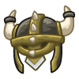

## _Armor - Wizard_

___

**Table of Contents:**

+ [Robes](#robes)
    * [Thin Burlap Robe](#thin-burlap-robe)
    * [Thick Burlap Robe](#thick-burlap-robe)
    * [Lambswool Cloak](#lambswool-cloak)
    * [Enchanted Lambswool Cloak](#enchanted-lambswool-cloak)
    * [Musty Linen Robe](#musty-linen-robe)
    * [Tailored Linen Robe](#tailored-linen-robe)
    * [Torn Silk Cloak](#torn-silk-cloak)
    * [Goldspun Silk Cloak](#goldspun-silk-cloak)
    * [Griffin Wool Robe](#griffin-wool-robe)
    * [Embroidered Griffin Wool Robe](#embroidered-griffin-wool-robe)

+ [Hats](#hats)
    * [Faux Fur Hat](#faux-fur-hat)
    * [Threadbare Burlap Wizards Hat](#threadbare-burlap-wizards-hat)
    * [Floppy Lambswool Hat](#floppy-lambswool-hat)
    * [Stiff Lambswool Hat](#stiff-lambswool-hat)
    * [Viking Helmet](#viking-helmet)
    * [Hand-Sewn Linen Wizard's Hat](#hand)
    * [Ragged Silk Cloak](#ragged-silk-hat)
    * [Goldspun Silk Hat](#goldspun-silk-hat)
    * [Griffin Wool Hat](#griffin-wool-hat)
    * [Embroidered Griffin Wool Hat](#embroidered-griffin-wool-hat)

___

### Robes

___

#### _THIN BURLAP ROBE_

It's probably too thin to keep you warm but at least it provides some protection.

+ Health: `+25`

___

#### _THICK BURLAP ROBE_

Perhaps ever Hagrid himself used this coat to keep warm in the winter.

+ Health: `+34`

___

#### _LAMBSWOOL CLOAK_

+ Health: `+58`

___

#### _ENCHANTED LAMBSWOOL CLOAK_

+ Health: `+67`

___

#### _MUSTY LINEN ROBE_

Smells like the old musty cabinet to Narnia...

+ Health: `+124`

___

#### _TAILORED LINEN ROBE_

You would think Wizards could fit their own robes, but here we are.

+ Health: `+137`

___

#### _TORN SILK CLOAK_

This cloak may be torn, but it's got a good amount of defense. They really did build stuff better in the olden days.

+ Health: `+200`

___

#### _GOLDSPUN SILK CLOAK_

+ Health: `+237`

___

#### _GRIFFIN WOOL ROBE_

You might think this is griffin cruelty, but in truth, it's artificial.

+ Health: `+459`

___

#### _EMBROIDERED GRIFFIN WOOL ROBE_

The eldritch runes lining this robe glow with unimaginable power.

+ Health: `+562`

___

### Hats

___

#### _FAUX FUR HAT_

Grants a little extra protection for your noggin.

+ Health: `+8`

___

#### _THREADBARE BURLAP WIZARDS HAT_

It may be raggedy, but it's a hat! All the more to protect your noggin with.

+ Health: `+13`

___

#### _FLOPPY LAMBSWOOL HAT_

+ Health: `+27`

___

#### _STIFF LAMBSWOOL HAT_

+ Health: `+32`

___

#### _VIKING HELMET_

This ferocious helmet triples bash knockback (if you have a bashing shield).

+ Health: `+50`
+ Bash Mass: `+200%`

___

#### _HAND-SEWN LINEN WIZARD'S HAT_

Homemade with love.

+ Health: `+63`

___

#### _RAGGED SILK HAT_

+ Health: `+101`

___

#### _GOLDSPUN SILK HAT_

Spun with gold. It's really not that hard to understand.

+ Health: `+137`

___

#### _GRIFFIN WOOL HAT_

+ Health: `+229`

___

#### _EMBROIDERED GRIFFIN WOOL HAT_

A griffin wool hat, but it's embroidered. Therefore it is much, much better.

+ Health: `+290`

___
