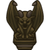
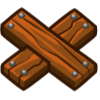
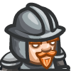

## Code Combat Game Development Methods and Objects
___


**Table of Contents:**
+ [Methods](#methods)
    * [Game Methods](#game)
        - [Spawn XY](#spawnxy)
        - [Spawn Player XY](#spawnplayerxy)
        - [Spawn Maze](#spawnmaze)
        - [Add Move Goal XY](#addmovegoalxy)
        - [Add Collect Goal](#addcollectgoal)
        - [Add Defeat Goal](#adddefeatgoal)
        - [Add Survive Goal](#addsurvivegoal)
        - [Add Manual Goal](#addmanualgoal)
        - [Set Goal State](#setgoalstate)
        - [DB Add](#dbadd)
        - [Random Integer](#randominteger)
        - [Set Action For](#setactionfor)
    * [Unit Methods](#unit)
        - [On](#on)
        - [Defeat](#defeat-u)
        - [Destroy](#destroy)
    * [Other Methods](#other)
        - [UI Track](#ui-track)
+ [Events](#events)
    * [Spawn](#spawn)
    * [Collect](#collect)
    * [Collide](#collide)
    * [Defeat](#defeat)
    * [Victory](#victory)
+ [Properties](#properties)
    * [Game Time](#game-time)
+ [Objects](#objects)
    * [Level Objects](#level-objects)
    * [Land Marks](#land-marks)
    * [Collectable](#collectable)
    * [Units](#units)
    * [Heroes](#heroes)

___


## Methods

___

### Game

___

#### _SpawnXY_

`game.spawnXY(type, x, y)`

> Spawn something at the given `x`, `y` coordinates.

**Example:**
```javascript
game.spawnXY("fence", 18, 15);
game.spawnXY("munchkin", 20, 25);
game.spawnXY("munchkin", 22, 25);
game.spawnXY("gem", 30, 30);
```

**Required Parameters:**
+ **`type`**: `string` (ex: `munchkin`) - _the type of object to build_
+ **`x`**: `number` (ex: `30`) - _the x-coordinate to build at_
+ **`y`**: `number` (ex: `30`) - _the y-coordinate to build at_

___

#### _SpawnPlayerXY_
`game.spawnPlayerXY(type, x, y)`

> Spawn a `hero` for the player to control at the given `x`, `y` coordinates.

**Example:**
```javascript
game.spawnPlayerXY("captain", 24, 37);
```

**Required Parameters:**
+ **`type`**: `string` (ex: `munchkin`) - _The type of hero to spawn._
+ **`x`**: `number` (ex: `30`) - _the x-coordinate to spawn a hero_
+ **`y`**: `number` (ex: `30`) - _the y-coordinate to spawn a hero_

___

#### _SpawnMaze_
`game.spawnMaze(tileType, seed)`

> Spawns a randomly generated maze of `tileType` tiles. The first argument is a string, type of the object which is used to build a maze. The second argument is a number, changing the number will change the maze.

**Example:**
```javascript
game.spawnMaze("forest", 5);
game.spawnMaze("clump", 23);
```

**Required Parameters:**
+ **`tileType`**: `string` (ex: `"forest"`) - _The type of the maze tile._
+ **`seed`**: `number` (ex: `23`) - _The seed number used to generate a maze._

___

#### _AddMoveGoalXY_
`game.addMoveGoalXY(x, y)`

> Add a movement goal at `x`, `y` coordinates. A movement goal is represented in the game by a red X mark. The player will have to move to all the movement goals in order to win.

**Example:**
```javascript
game.addMoveGoalXY(23, 47);
```

**Required Parameters:**
+ **`x`**: `number` (ex: `30`) - _The x coordinate to add a goal._
+ **`y`**: `number` (ex: `30`) - _The y-coordinate to add a goal._

___

#### _AddCollectGoal_
`game.addCollectGoal(amount)`

> Adds a goal to the game: The player must collect gems! The argument specifies the number of collectable items the player needs to collect. If there is no argument, the player must collect all the items._

**Example:**
```javascript
game.addCollectGoal();
```

**Optional Parameters:**
+ **`amount`**: `number` (ex: `5`) - _The amount of items that need to be collected._

___

#### _AddDefeatGoal_
`game.addDefeatGoal(amount)`

> Adds a goal to the game: The player must defeat enemies! The argument specifies the number of enemies that need to be defeated. If there is no argument, the player must defeat all the enemies.

**Example:**
```javascript
game.addDefeatGoal();
```

**Optional Parameters:**
+ **`amount`**: `number` (ex: `5`) - _The amount of items that need to be defeated._

___

#### _AddSurviveGoal_
`game.addSurviveGoal(seconds)`

> Adds a goal to the game: If no argument is given, the player must survive until all other goals are completed. If a number argument is given, the player must survive for that many seconds.

**Example:**
```javascript
game.addSurviveGoal();
game.addSurviveGoal(20);
```

**Optional Parameters:**
+ **`seconds`**: `number` (ex: `20`) - _The number of seconds the player must survive for._

___

#### _AddManualGoal_
`game.addManualGoal(description)`

> Add a manually controlled game goal with a description.

**Example:**
```javascript
var someGoal = game.addManualGoal("Do the thing.");
var nextGoal = game.addManualGoal("Do nothing.");

// Checking the goal state.
if (someGoal.success) {
    hero.say("Done!");
}
```

**Required Parameters:**
+ **`description`**: `string` (ex. `"Defeat the Boss."`) - _The text description of the goal_

**Returns:**
+ `object`: The goal object.

___

#### _SetGoalState_
`game.setGoalState(goal, success)`

> Set the state of the goal, which you've defined earlier. This function change the goal's property `success`.

**Example:**
```javascript
var someGoal = game.addManualGoal("Do the thing.");
var nextGoal = game.addManualGoal("Do nothing.");

//# Goal success!
game.setGoalState(someGoal, true);

// Goal failure! (ends the game)
game.setGoalState(nextGoal, false);

// Checking the goal state.
if (someGoal.success) {
    hero.say("Done!");
}
```

**Required Parameters:**
+ **`goal`**: `object` (ex. `myGoal`) - _The goal object_
+ **`success`**: `boolean` (ex. `true`) - _The state of the goal: success or not_

___

#### _DBAdd_
`game.db.add(key, value)`

> Use `db.add(key, value)` to increment (add to) a value stored in the database under a key. If a key doesn't exist in the database yet, its value starts at `0`

**Example:**
```javascript
db.add("plays", 1);
```

**Required Parameters:**
+ **`key`**: `string` (ex: `"plays"`) - _The database key to store a value under._
+ **`value`**: `number` (ex: `1`) - _The value to increment by._

___

#### _RandomInteger_
`game.randomInteger(min, max)`

> Generate a random integer between `min` and `max`, inclusive.

**Example:**
```javascript
game.randomInteger(0, 9);
```

**Required Parameters:**
+ **`min`**: `number` (ex. `0`) - _The minimum value the random integer can be_
+ **`max`**: `number` (ex. `9`) - _The maximum value the random integer can be_

___

#### _SetActionFor_
`game.setActionFor(type, event, handler)`

> Sets an event handler on all units of a particular type, whether they are spawned before or after this command is executed.

**Example:**
```javascript
game.setActionFor("munchkin", "spawn", runAway);
game.setActionFor("soldier", "spawn", fightEnemies);
game.setActionFor("archer", "spawn", fightEnemies);
```

**Required Parameters:**
+ **`type`**: `string` (ex. `"soldier"`) - _The type of unit to setActionFor_
+ **`event`**: `string` (ex. `"spawn"`) - _The type of event_
+ **`handler`**: `function` (ex. `fightEnemiesd`) - _The function that is called when the event is triggered_

___

### Unit

___

#### _On_
`unit.on(eventName, eventHandlerFunction)`

> You can use the `unit.on(eventName, eventHandlerFunction)` function to assign custom behavior to a unit. The `eventHandlerFunction` argument is a function you define. You can put any code in here you want! You are the game developer after all.

**Example:**
```javascript
function munchkinLogic() {
    while (true) {
        var enemy = munchkin.findNearestEnemy();
        if (enemy) {
            munchkin.attack(enemy);
        }
    }
}

var munchkin = game.spawnXY("munchkin", 20, 20);
munchkin.on("spawn", munchkinLogic);
```

**Required Parameters:**
+ **`eventName`**: `string` (ex: `"spawn"`) - _The event that will trigger handler function_
+ **`eventHandlerFunction`**: `function` (ex: `onSpawn`) - _The function that will be executed after event occurs_

___

#### _Defeat-u_
`unit.defeat()`

> `defeat()` is like `unit.health = 0` and can be applied only to units or attackable objects like `"generator"`. Also the "defeated" object remains in the game scene. Plus it increases `game.defeated` counter for enemy units. You can use it for "restricted zones", ruin some objects on events and so on.

**Example:**
```javascript
var generator = game.spawnXY("generator", 40, 34);

while (true) {
    if (game.time == 10) {
        generator.defeat();   // It's ruined and we see some remained stones.
        player.say("I haven't touched it. It was broken itself.");
    }
}
```

___

#### _Destroy_
`unit.destroy()`

> `destroy()` removes an object from the game scene and can be used for anything. Especially it useful for obstacles, because they don't have `health` and can't be `defeat`ed. You can remove obstacles for some events, for example, clear forest passage in this level. There are more usages for that method which we will see later.

**Example:**
```javascript
var potion = game.spawnXY("potion", 40, 34);

while (true) {
    if (game.time == 10) {
        potion.destroy();  // Just an empty space.
        player.say("Where is it? It was here just a second ago.");
    }
}
```

___

### Other

___

#### _UI Track_
`ui.track(obj, prop)`

> Use `ui.track(obj, "prop")` to display a value of a `obj.prop` to the player

**Example:**
```javascript
ui.track(game, "time");
ui.track(player, "health");
```

**Required Parameters:**
+ **`obj`**: `object` (ex: `game`) - _The object containing a property you want to show._
+ **`prop`**: `string` (ex: `"time"`) - _The name (as a string!) of the property you want to show._

___


## Events

> An **event** is something that happens in the game world. For example, a `"spawn"` event happens when a unit is created (spawned). A `"hear"` event happens when a unit hears another unit `say()` something.

You can register a function as an **event handler** using the `on(eventType, eventHandler)` method.

An **event handler** function is run when the specified type of event happens:
```javascript
// Define an event handler function:
function onHear() {
    pet.say("I heard something!");
}

// Register onHear as an event handler for "hear" events on the pet object.
pet.on("hear", onHear);
```

___

### _Spawn_

> The `"spawn"` event is triggered when a unit is spawned.

**Example:**
```javascript
function onSpawn(event) {
    // This function is run when unit is spawned.
    var unit = event.target;
    unit.say("Reporting for duty!");
}

unit = game.spawnXY("soldier", 20, 20);
unit.on("spawn", onSpawn);
```

___

### _Collect_

> The `"collect"` event is triggered when a unit collect any item.

**Example:**
```javascript
function onCollect(event) {
    var unit = event.target;
    var item = event.other;
    unit.say("I've taken " + item.id);
}

var hero = game.spawnHeroXY("knight", 20, 20);
hero.on("collect", onCollect);
```

___

### _Collide_

> The `"collide"` event is triggered when an object collides with another object (obstacles or units).

**Example:**
```javascript
function onCollide(event) {
    var unit = event.target;
    var other = event.other;
    unit.say("I've bumped into " + other.id);
}

var hero = game.spawnHeroXY("knight", 20, 20);
unit.on("collide", onSpawn);
```

___

### _Defeat_

> The `"defeat"` event is triggered when a unit s defeated.

**Example:**
```javascript
function onDefeat(event) {
    var unit = event.target;
    var x = unit.pos.x + game.randomInteger(-5, 5);
    var y = unit.pos.y + game.randomInteger(-5, 5);
    game.spawnXY("gold-coin", x, y);
}

game.setActionFor("munchkin", "defeat", onDefeat);
```

___

### _Victory_

> The `"victory"` event is triggered when a player successfully completes all of a game's goals.

Example:
```javascript
function onVictory(event) {
    db.add("plays", 1);
}

game.on("victory", onVictory);
```

___


## Properties

___

### _Game Time_

> `game.time` is the amount of time (in seconds) that has passed since the start of the game. The `game.time` property is equal to the number of `seconds` that have passed since the start of your game. Use `game.time` to spawn enemies over time (in this case, every 2 seconds) like this.


**Example:**
```python
spawnTime = 0

while True:
    if game.time > spawnTime:
        game.spawnXY("munchkin", 20, 40)
        # Next spawnTime set to current game.time + 2
        spawnTime = game.time + 2
```

**Start Value:**
+ _null_

___


## Objects

___

### Level Objects


+ `"fence"` - A square obstacle, 4 meters on a side.


+ `"forest"` - A square obstacle made of trees, 8 meters on a side.


+ `"fire-trap"` - A trap that explodes when the player gets too close to it. Default stats:
    + `unit.attackDamage = 150`
    + `unit.attackRange = 3`


+ `"fire-spewer"` - A gargoyle statue that shoots deadly fireballs. It has the following configurable properties:
    + `direction` - (string) can be set to `"horizontal"` or `"vertical"`
    + `disabled = false` - (boolean) can be `true` or `false`. True means it won't fire.
    + `spamInterval = 2` - (number) how many seconds it will fire for
    + `spamCooldown = 2` - (number) how many seconds to wait in between firing intervals
    + `spamEvery = 0.2` - (number) how many seconds in between each fireball during firing intervals



+ `"generator"` - A generator continues to spawn units every so often, until it is destroyed. Default Stats:
    + `generator.spawnDelay = 5` - (number) how many seconds to wait between spawns
    + `generator.spawnType = "skeleton"` - (string) type of spawned unit
    + `generator.spawnAI = "AttacksNearest"` - (string) type of spawned unit's AI
    + `generator.maxHealth = 100` - (number) hom many health does it have


___

### _Land Marks_


#### `x-mark-stone`

> An X Mark made of stone.


**Example:**
```javascript
var xmark = game.spawnXY("x-mark-stone", 12, 40);

function checkProximity() {
    if(xmark.distanceTo(player) <= 1) {
        // Do something interesting!
    }
}

while(true) {
    checkProximity();
}
```

#### `x-mark-bones`

> An X Mark made of bones.


**Example:**
```javascript
var xmark = game.spawnXY("x-mark-bones", 12, 40);

function checkProximity() {
    if(xmark.distanceTo(player) <= 1) {
        // Do something interesting!
    }
}

while(true) {
    checkProximity();
}
```

#### `x-mark-wood`

> An X Mark made of wood.



**Example:**
```javascript
var xmark = game.spawnXY("x-mark-wood", 12, 40);

function checkProximity() {
    if(xmark.distanceTo(player) <= 1) {
        // Do something interesting!
    }
}

while(true) {
    checkProximity();
}
```

___

### Collectable


+ `"gem"` - A collectable gemstone. Default stats:
    + `gem.value = 5`


+ `"chest"` - A collectable chest full of gems. Default stats:
    + `chest.value = 100`


+ `"locked-chest"` - To open this chest you need a `silver-key`. Default stats:
    + `chest.value = 100`

+ `"silver-key"` - Key to open locked chest.

+ `"potion-small"` - A small health potion. Heals 150 health when collected.


+ `"potion-medium"` - A medium health potion. Heals 350 health when collected.


+ `"potion-large"` - A large health potion. Heals 1000 health when collected.


+ `"lightstone"` - A glowing magical stone. Skeletons will flee from anyone carrying a lightstone.


#### _Coins_

> Gold coin


**Default Stats:**
+ `type: "gold-coin"`
+ `voin.value = 3`

**Example:**
```python
# usage code 
game.spawnXY("gold-coin", 21, 20)
```

> Silver coin


**Default Stats:**
+ `type: "silver-coin"`
+ `voin.value = 2`

**Example:**
```python
# usage code 
game.spawnXY("silver-coin", 21, 20)
```

> Bronze coin


**Default Stats:**
+ `type: "bronze-coin"`
+ `voin.value = 1`

**Example:**
```python
# usage code 
game.spawnXY("bronze-coin", 21, 20)
```


#### _Mushroom_

> It's a collectable item. It doesn't have any effects by default. Use it as you want.


**Default Stats:**
+ `type: "mushroom"`

**Example:**
```python
# usage code 
game.spawnXY("mushroom", 21, 20)
```

___

### Units


+ `"munchkin"` - The weakest ogre unit. Has a melee attack. Default Stats:
    + `unit.team = "ogres"`
    + `unit.maxHealth = 14`
    + `unit.attackDamage = 2`
    + `unit.maxSpeed = 12`


+ `"thrower"` - An ogre with a ranged attack: thrown speaars. Does good damage, but has low health. Default Stats:
    + `unit.team = "ogres"`
    + `unit.maxHealth = 7`
    + `unit.attackDamage = 11`
    + `unit.attackRange = 25`
    + `unit.maxSpeed = 11`


+ `"scout"` -  The mediocre ogre unit. It's stronger than a munchkin. Has a melee attack. Default Stats:
    + `unit.team = "ogres"`
    + `unit.maxHealth = 75`
    + `unit.attackDamage = 12`
    + `unit.maxSpeed = 12`


+ `"ogre"` -  A big ogre. Default Stats:
    + `unit.team = "ogres"`
    + `unit.maxHealth = 120`
    + `unit.attackDamage = 18`
    + `unit.maxSpeed = 5`


+ `"ogre-f"` -  A bigger ogre. Default Stats:
    + `unit.team = "ogres"`
    + `unit.maxHealth = 250`
    + `unit.attackDamage = 30`
    + `unit.maxSpeed = 7`
    + P.S.: `unit.type = "ogre"` (not `"ogre-f"`)


+ `"skeleton"` - A tough enemy, but terrified of anyone holding a Lightstone. Default Stats:
    + `unit.team = "neutral"`
    + `unit.maxHealth = 300`
    + `unit.attackDamage = 15`
    + `unit.maxSpeed = 7`


+ `"soldier"` - A basic human melee unit. Default Stats:
    + `unit.team = "humans"`
    + `unit.maxHealth = 200`
    + `unit.attackDamage = 6`
    + `unit.maxSpeed = 6`



+ `"archer"` - A basic human ranged unit. Default Stats:
    + `unit.team = "humans"`
    + `unit.maxHealth = 30`
    + `unit.attackDamage = 13`
    + `unit.attackRange = 25`
    + `unit.maxSpeed = 9`


___

### Heroes:


+ `"knight"` - Sir Tharin Thunderfist. Default Stats:
    + `player.maxHealth = 350`
    + `player.attackDamage = 4.32`
    + `player.maxSpeed = 6`


+ `"captain"` - Captain Anya Weston. Default Stats:
    + `player.maxHealth = 350`
    + `player.attackDamage = 4.32`
    + `player.maxSpeed = 6`


+ `"guardian"` - Illia Shieldsmith. Default Stats:
    + `player.maxHealth = 350`
    + `player.attackDamage = 4.32`
    + `player.maxSpeed = 10`


+ `"samurai"` - Hattori Hanzo. Default Stats:
    + `player.maxHealth = 178.57`
    + `player.attackDamage = 9.72`
    + `player.maxSpeed = 8`


+ `"duelist"` - Alejandro the Duelist. Default Stats:
    + `player.maxHealth = 350`
    + `player.attackDamage = 4.32`
    + `player.maxSpeed = 6`


+ `"goliath"` - Okar Stompfoot. Default Stats:
    + `player.maxHealth = 500`
    + `player.attackDamage = 7.68`
    + `player.maxSpeed = 4`


+ `"champion"` - Lady Ida Justheart. Default Stats:
    + `player.maxHealth = 350`
    + `player.attackDamage = 4.32`
    + `player.maxSpeed = 6`


___
