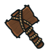
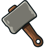

## _Hammers_

___

### _CRUDE BUILDER'S HAMMER_

Grants the ability to build fences and fire traps.



+ `"fence"`
+ `"fire-trap"`

#### _`hero.buildTypes`_ property

List of unit types the hero can build or summon.

#### _`hero.buildXY(type, x, y)`_ method

Builds a unit at the given `x` and `y` coordinates.

**Example:**

```javascript
hero.buildXY("fence", 36, 30);
```

**Required Parameters:**

+ `buildType`: `string` (ex. `"fence"`) - _The type of unit to build_
+ `x`: `number` (ex. `36`) - _The x-coordinate to build at_
+ `y`: `number` (ex. `30`) - _The y-coordinate to build at_

___

### _WOODEN BUILDER'S HAMMER_

Adds the ability to build Decoys for 25 gold.


+ `hero.buildTypes`
+ `hero.buildXY(type, x, y)`

+ `"fence"`
+ `"fire-trap"`
+ `"decoy"`

___

### _STONE BUILDER'S HAMMER_

Adds the ability to build defensive Arrow Towers.



+ `hero.buildTypes`
+ `hero.buildXY(type, x, y)`

+ `"fire-trap"`
+ `"decoy"`
+ `"arrow-tower"`

___
