## _Heroes_

___


**Table of Contents:**

+ [Hero Say Method](#hero-say)

+ [Standart Heroes](#standart-heroes)
    * [captain Anya Weston](#captain-anya-weston)
    * [sir Tharin Thunderfist](#sir-tharin-thunderfist)
    * [lady Ida Justheart](#lady-ida-justheart)
    * [Alejandro the Duelist](#alejandro-the-duelist)

+ [Silver Heroes](#silver-heroes)
    * [Amara Arrowhead](#amara-arrowhead)
    * [miss Hushbaum](#miss-hushbaum)
    * [Hattori Hanzō](#hattori-hanzō)

+ [Premium Heroes](#premium-heroes)
    * [Pender Spellbane](#pender-spellbane)
    * [Senick Steelclaw](#senick-steelclaw)
    * [Omarn Brewstone](#omarn-brewstone)
    * [Gordon the Stalwart](#gordon-the-stalwart)
    * [Naria of the Leaf](#naria-of-the-leaf)
    * [Arryn Stonewall](#arryn-stonewall)
    * [Nalfar Cryptor](#nalfar-cryptor)
    * [Okar Stompfoot](#okar-stompfoot)
    * [Ritic the Cold](#ritic-the-cold)

___

> First of all, from start we've got one natural ability.

#### _Hero Say_
`hero.say(message)` method

Makes the hero say the given message. Anything within `20` meters will hear it.

+ Action name: `"say"`
+ Time: `1s`

**Example:**

```javascript
hero.say("Hi!");
```

**Required Parameters:**
+ `message`: `string` (ex. `"Hi!"`)

___

### _Standart Heroes_

They have idential statistics, so they difference only cosmetic. They doesn't have any special abilities.

**Statistics:**
+ Difficulty: `Easy`
+ Type: `Warrior`
+ Weapons: `Swords - Short Range, No Magic`
+ Damage: `120%`
+ Health: `140%`
+ Speed: `6 m/s`

___

#### Captain _Anya Weston_

Anya is a no-nonsense leader who isn't afraid to go in and get the job done, whether it's defending a village, raiding an ogre base, or picking up shiny things.

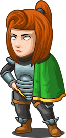

#### Sir _Tharin Thunderfist_

A mighty warrior. Tharin loves just three things: exploring, building stuff, and combat. He's tough but slow.


#### Lady _Ida Justheart_

Lady Ida Justheart is a champion of the people, questing for justice across all the lands. No one knows what she does in her spare time.

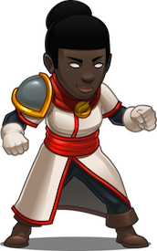

#### _Alejandro the Duelist_

Alejandro travels across the world, seeking out challenges to test his skills with his impractically gigantic sword and tiny shield.

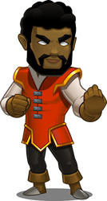

___

### _Silver Heroes_

#### _Amara Arrowhead_

Stealthy and silent, Amara’s ranged attacks can pick off the fastest of ogres with ease. But keep her away from the fray as her armor is light!

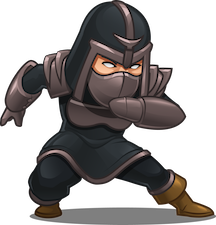

**Statistics:**
+ Difficulty: `Medium`
+ Type: `Ranger`
+ Weapons: `Crossbows, Guns - Long Range, No Magic`
+ Damage: `100%`
+ Health: `120%`
+ Speed: `10 m/s`

___

#### Miss _Hushbaum_

Hushbaum learned her trade at the citadel and honed it on the battlefield. Her wand and staff allow her to bend the laws of reality.


> My first choise of start hero for dungeon \ forest. But too slow for any speed records.

**Statistics:**
+ Difficulty: `Hard`
+ Type: `Wizard`
+ Weapons: `Wands, Staffs - Long Range, Magic`
+ Damage: `120%`
+ Health: `140%`
+ Speed: `7 m/s`

___

#### _Hattori Hanzō_

Hattori is an honorable retainer and fearless warrior. His speed and high damage make him ideal for taking on heavily-armored enemies.


**Statistics:**
+ Difficulty: `Easy`
+ Type: `Warrior`
+ Weapons: `Swords - Short Range, No Magic`
+ Damage: `180%`
+ Health: `71%`
+ Speed: `8 m/s`

___

### _Premium Heroes_

> As for now I only got one speedy hero to perform advanced solutions. Maybe later in the game I'll buy some more, but now I can't review other premium heroes abilities.

___

#### _Pender Spellbane_

Nobody knows where Pender came from, but the few who have asked did not live to tell the tale. She sees great power in you.

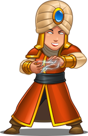

**Statistics:**
+ Difficulty: `Hard`
+ Type: `Wizard`
+ Weapons: `Wands, Staffs - Long Range, Magic`
+ Damage: `180%`
+ Health: `52%`
+ Speed: `14 m/s`
+ Abilities: `Mana Blast`, `Reset Cooldown`
+ Cost: `3,400 gems`

##### `hero.manaBlast()` method

The `"mana-blast"` action makes the hero do a powerful magical blast centered around the hero, dealing up to `100` damage to targets at the center of the `20m` blast.

+ Action name: `"mana-blast"`
+ Time: `0.75s`
+ Cooldown: `15s`
+ Damage: `100`
+ Radius: `20m`

**Example:**

```javascript
hero.manaBlast();
```

##### `hero.resetCooldown(action)` method

Resets the given `action` cooldown, making it ready to be used again, if the `reset-cooldown` ability is ready. Can also reset spell cooldowns.

+ Action name: `"reset-cooldown"`
+ Time: `0.25s`
+ Cooldown: `20s`

**Example:**

```javascript
hero.resetCooldown("raise-dead");
```

**Required Parameters:**
+ `action`: `string` (ex. `"raise-dead"`). _The action to reset_

___

#### _Senick Steelclaw_

Senick is a ruthless hunter. He eliminates his enemies without mercy. He is only interested in attacking and carries little to no armor.

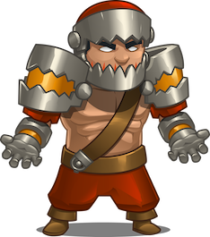

**Statistics:**
+ Difficulty: `Medium`
+ Type: `Ranger`
+ Weapons: `Crossbows, Guns - Long Range, No Magic`
+ Damage: `140%`
+ Health: `180%`
+ Speed: `6 m/s`
+ Abilities: `Heal`
+ Cost: `1,400 gems`

##### `hero.heal(target)` method

???

___

#### _Omarn Brewstone_

An expert in black hat magic, the potion master wields his immense power through his wand and staff. He was an apprentice before Hushbaum was born.


**Statistics:**
+ Difficulty: `Hard`
+ Type: `Wizard`
+ Weapons: `Wands, Staffs - Long Range, Magic`
+ Damage: `83%`
+ Health: `120%`
+ Speed: `11 m/s`
+ Abilities: `Throw`
+ Cost: `1,800 gems`

##### `hero.throw(args)` method

???

___

#### _Gordon the Stalwart_

Gordon the Stalwart stands steadfast, stoicly safeguarding citizens. He hates bad puns and will throw his supernaturally heavy hammer at anyone who makes one.

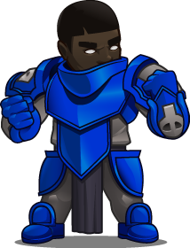

**Statistics:**
+ Difficulty: `Easy`
+ Type: `Warrior`
+ Weapons: `Swords - Short Range, No Magic`
+ Damage: `83%`
+ Health: `180%`
+ Speed: `7 m/s`
+ Abilities: `Throw`
+ Cost: `2,100 gems`

##### `hero.throw(args)` method

???

___

#### _Naria of the Leaf_

Nobody expects Naria or the Spanish Inquisition and her ranged attacks keep it that way. Engage at a distance to keep her safe.

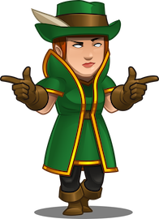

**Statistics:**
+ Difficulty: `Medium`
+ Type: `Ranger`
+ Weapons: `Crossbows, Guns - Long Range, No Magic`
+ Damage: `83%`
+ Health: `160%`
+ Speed: `11 m/s`
+ Abilities: `Envenom`, `Hide`
+ Cost: `2,500 gems`

##### `hero.envenom(args)` method

???

##### `hero.hide(args)` method

???

___

#### _Arryn Stonewall_

Arryn is an incredibly friendly and warm person, always ready to lend a hand–unless you happen to have treasure she wants. Then she'll cut you.

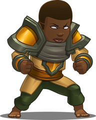

**Statistics:**
+ Difficulty: `Easy`
+ Type: `Warrior`
+ Weapons: `Swords - Short Range, No Magic`
+ Damage: `63%`
+ Health: `100%`
+ Speed: `14 m/s`
+ Abilities: `Envenom`, `Hide`
+ Cost: `4,600 gems`

##### `hero.throw(args)` method

???

##### `hero.warcry(args)` method

???

___

#### _Nalfar Cryptor_

A dark elf who sees skeletons as totally adorable, Nalfar Cryptor thinks being a necromancer is just like being a dog person. "Just look at their widdle eye sockets!"

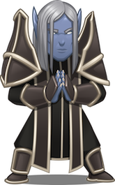

**Statistics:**
+ Difficulty: `Hard`
+ Type: `Wizard`
+ Weapons: `Wands, Staffs - Long Range, Magic`
+ Damage: `71%`
+ Health: `200%`
+ Speed: `10 m/s`
+ Abilities: `Cast Sacrifice`, `Devour`, `Cast Soul Link`
+ Cost: `6,300 gems`

##### `hero.castSacrifice(args)` method

???

##### `hero.devour(args)` method

???

##### `hero.castSoulLink(args)` method

???

___

#### _Okar Stompfoot_

Even among the other goliaths, Okar Stompfoot was just too big and too slow. Now in exile for one too many accidental crushings, he longs to pick on someone his own size.

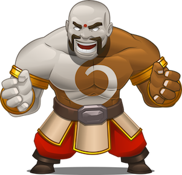

**Statistics:**
+ Difficulty: `Easy`
+ Type: `Warrior`
+ Weapons: `Swords - Short Range, No Magic`
+ Damage: `160%`
+ Health: `200%`
+ Speed: `4 m/s`
+ Abilities: `Stomp`, `Throw`, `Hurl`
+ Cost: `12,000 gems`

##### `hero.stomp(args)` method

???

##### `hero.throw(args)` method

???

##### `hero.hurl(args)` method

???

___

#### _Ritic the Cold_

Forged from the coldest depths of Kelvintaph, Ritic did not know who he was, or how he originated. He just has one order: assassinate.

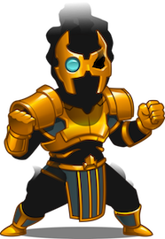

**Statistics:**
+ Difficulty: `Medium`
+ Type: `Ranger`
+ Weapons: `Crossbows, Guns - Long Range, No Magic`
+ Damage: `160%`
+ Health: `120%`
+ Speed: `11 m/s`
+ Abilities: `Wall Of Darkness`, `Shadow Vortex`, `Blink`, `Phase Shift`
+ Cost: `29,000 gems`

##### `hero.wallOfDarkness(args)` method

???

##### `hero.shadowVortex(args)` method

???

##### `hero.blink(args)` method

???

##### `hero.phaseShift(args)` method

???

___
