## _Secondary - Ranger_

___


**Table of Contents:**

* [Daggers](#daggers)
    * [Sharpsong](#sharpsong)
    * [Bone Dagger](#bone-dagger)
    * [Dragontooth](#dragontooth)
* [Throwable Daggers](#throwable-daggers)
    * [Crude Dagger](#crude-dagger)
    * [Moonlit Blade](#moonlit-blade)
    * [Undergrowth Dagger](#undergrowth-dagger)
    * [Weighted Throwing Knives](#weighted-throwing-knives)
    * [Razordisc](#razordisc)
* [Bombs](#bombs)
    * [Weak Charge](#weak-charge)
    * [Powder Charge](#powder-charge)
    * [Knightfire Charge](#knightfire-charge)
    * [Glitterbomb](#glitterbomb)
    * [Sparkbomb](#sparkbomb)
    * [Boom Ball](#boom-ball)

___


### Daggers

___

#### _SHARPSONG_

Very short range dagger with a lower cooldown. Not a thrown weapon, but a backstabbing dagger–only effective from behind!

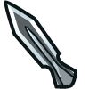

+ Damage Backstab: `79.92`

##### _`hero.backstab(target)`_ method

The `backstab` action is a powerful attack dealing `damageFactor` damage if the target is facing away from the hero, but only `10%` of that otherwise.

Will chase if the target is further than `3m`.

**Stats:**
+ Name: `"backstab"`
+ Damage: `damageFactor` (`x` for current dagger)
+ Time: `0.5s`
+ Cooldown: `25s`

**Example:**

```javascript
hero.backstab(hero.findNearestEnemy());
```

**Required Parameters:**
+ `target`: `object` (ex. `hero.findNearestEnemy()`) - _The target to backstab_

___

#### _BONE DAGGER_

This haunted bone shard's backstab is rumored to pierce through metal, leather, flesh, and even its target's soul.

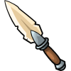

+ Damage Backstab: `493.8`

___

#### _DRAGONTOOTH_

The elder dragon from which this tooth was taken extinguished many souls during its thousand-year rampage.


+ Damage Backstab: `706.22`

___


### Throwable Daggers

___

#### _CRUDE DAGGER_

Medium range, fast, low-damage throwing dagger. 1-second cooldown.

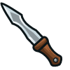

+ Damage: `6.9`
+ Range: `15m`
+ Cooldown: `1s`

##### _`hero.throw(target)`_ method

Throw a missile at a `target` enemy if within `throwRange`.

**Stats:**
+ Name: `"throw"`
+ Damage: `damageFactor` (`6.9` for current dagger)
+ Range: `rangeFactor` (`15m` for current dagger)
+ Time: `0.5s`
+ Cooldown: `speedFactor` (`1s` for current dagger)

**Example:**

```javascript
var enemy = hero.findNearestEnemy();
if (hero.isReady("throw") && hero.distanceTo(enemy) < hero.throwRange) {
    hero.throw(enemy);
}
```

**Required Parameters:**
+ `target`: `object` (ex. `hero.findNearestEnemy()`) - _The target to throw at_


##### _`hero.throwRange`_ property

How far the hero's throw reaches, in meters.

___

#### _MOONLIT BLADE_

Short range, high damage, slow attack. Ideal for tossing at big targets. 18 second cooldown.

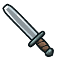

+ Damage: `46.33`
+ Range: `11m`
+ Cooldown: `18s`

+ `hero.throw(target)`
+ `hero.throwRange`

___

#### _UNDERGROWTH DAGGER_

The Undergrowth Dagger is an excellent sniper weapon. It has very long range and high damage. It also deals knockback to targets. Good things come with a price: 25 second cooldown.

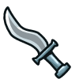

+ Damage: `125.67`
+ Range: `50m`
+ Cooldown: `25s`

+ `hero.throw(target)`
+ `hero.throwRange`

___

#### _WEIGHTED THROWING KNIVES_

Hits very hard but has a long cooldown of 23 seconds.

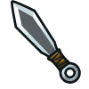

+ Damage: `126.12`
+ Range: `13m`
+ Cooldown: `23s`

+ `hero.throw(target)`
+ `hero.throwRange`

___

#### _RAZORDISC_

Throw infinitely bouncy razor discs that won't stop until they bite into an enemy.


+ Damage: `71.23`
+ Range: `55m`
+ Cooldown: `?`

+ `hero.throw(target)`
+ `hero.throwRange`

##### _hero.throwPos(position)_ method

Throw a missile at the `targetPos` position if within `throwRange`.

___


### Bombs

___

#### _WEAK CHARGE_

Does more damage and has a much longer range than either the Poisoned Throwing Shard or the Crude Dagger. Takes 2 seconds to prepare the next charge.

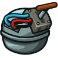

+ Damage: `20.76`
+ Range: `34m`
+ Cooldown: `2s`

+ `hero.throw(target)`
+ `hero.throwRange`

___

#### _POWDER CHARGE_

Medium range, high damage, medium cooldown. The Powder Charge is a heavy ranged projectile. Takes 16 seconds to prep the next charge.

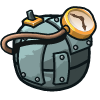

+ Damage: `49.94`
+ Range: `12m`
+ Cooldown: `16s`

+ `hero.throw(target)`
+ `hero.throwRange`

___

#### _KNIGHTFIRE CHARGE_

Close-range, fast, high-damage incendiary charge. Does significantly more damage than the Weighted Throwing Knives. Just don't blow yourself up. Takes 10 seconds to prep the next charge.

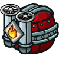

+ Damage: `72.82`
+ Range: `15m`
+ Cooldown: `10s`

+ `hero.throw(target)`
+ `hero.throwRange`

___

#### _GLITTERBOMB_

Filled with a secret formula that blinds and scalds everything caught in its blast.

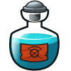

+ Damage: `90.17`
+ Range: `15m`
+ Cooldown: `?`

+ `hero.throw(target)`
+ `hero.throwPos(position)`
+ `hero.throwRange`

___

#### _SPARKBOMB_

The boiling silverfire contained within is rumored to melt bones, but there have been no surviving first-hand witnesses to its power.

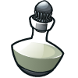

+ Damage: `329.89`
+ Range: `31m`
+ Cooldown: `?`

+ `hero.throw(target)`
+ `hero.throwPos(position)`
+ `hero.throwRange`

___

#### _BOOM BALL_

A good demolitionist can throw four boom balls per second. A master demolitionist can survive the experience.


+ Damage: `20`
+ Range: `41m`
+ Cooldown: `0.25s`

+ `hero.throw(target)`
+ `hero.throwPos(position)`
+ `hero.throwRange`

___
