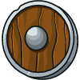
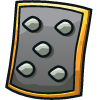
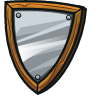
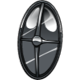
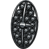

## Shields

___


**Table of Contents:**

* [Wooden Shield](#wooden-shield)
* [Bronze Shield](#bronze-shield)
* [Polished Bronze Shield](#polished-bronze-shield)
* [Sturdy Bronze Shield](#sturdy-bronze-shield)
* [Iron Shield](#iron-shield)
* [Defensive Infantry Shield](#defensive-infantry-shield)
* [Crude Spike](#crude-spike)
* [Infantry Shield](#infantry-shield)
* [Steel Shield](#steel-shield)
* [Painted Steel Shield](#painted-steel-shield)
* [Steel Striker](#steel-striker)
* [Obsidian Shield](#obsidian-shield)
* [The Monolith](#the-monolith)
* [Engraved Obsidian Shield](#engraved-obsidian-shield)
* [Worn Dragonshield](#worn-dragonshield)
* [Enameled Dragonshield](#enameled-dragonshield)
* [Deflector](#deflector)

___

#### _WOODEN SHIELD_

A little extra protection for your left side.



+ Health: `+15`

___

#### _BRONZE SHIELD_

Blocks just 38% of damage while shielding--better start saving for an upgrade.


+ Health: `+33`
+ Blocks: `+38%`

##### _`hero.shield()`_ method

While using the `shield` action, the shield blocks `blockFactor` (`38%` for this shield) of normal damage. Takes `0.324s`.

**Example:**

```javascript
if (hero.findFriends().length > 5) {
    hero.shield();
} else {
    hero.attack(enemy);
}
```

___

#### _POLISHED BRONZE SHIELD_

Adds slightly more health than the bronze shield.


+ Health: `+38`
+ Blocks: `+44%`

+ `hero.shield()`

___

#### _STURDY BRONZE SHIELD_

Very similar to the polished bronze shield. For those that don't like the color green.


+ Health: `+38`
+ Blocks: `+46%`

+ `hero.shield()`

___

#### _IRON SHIELD_

Grants a decent health bonus and block factor. It's a hunk of iron, after all.


+ Health: `+50`
+ Blocks: `+40%`

+ `hero.shield()`

___

#### _DEFENSIVE INFANTRY SHIELD_

Huge upgrade on the bronze shields: lower cooldown, higher defense factor, and more health. Also enables the shield bash attack.


+ Health: `+75`
+ Blocks: `+46.7%`
+ Damage: `6.4`

+ `hero.shield()`

##### _`hero.bash(target)`_ method

The `bash` secondary attack deals `damageFactor` damage and knocks the target back.

**Stats:**
+ Name: `"bash"`
+ Damage: `damageFactor` (`6.4` for current shield)
+ Time: `0.324s`
+ Cooldown: `6s`

**Example:**

```javascript
hero.bash(hero.findNearestEnemy());
```

**Required Parameters:**
+ `target`: `object` (ex. `hero.findNearestEnemy()`) - _The target to bash_

___

#### _CRUDE SPIKE_

High knockback, bash damage, and defensive, but slower than the Defensive Infantry Shield.



+ Health: `+85`
+ Blocks: `+48.6%`
+ Damage: `18.6`

+ `hero.bash(target)`
+ `hero.shield()`

___

#### _INFANTRY SHIELD_

Gives heroes a big health bonus and defense factor, but it's slow and doesn't have bash.


+ Health: `+97`
+ Blocks: `+50.5%`

+ `hero.shield()`

___

#### _STEEL SHIELD_

Big upgrade in health and defense, but it's slow. Enables bash with both improved knockback and damage.



+ Health: `+154`
+ Blocks: `+60.4%`
+ Damage: `35`

+ `hero.bash(target)`
+ `hero.shield()`

___

#### _PAINTED STEEL SHIELD_

Equally useful as a shield and as a battering ram. It gives slightly more health than the steel shield, but does massive knockback and damage from bash.


+ Health: `+158`
+ Blocks: `+60.1%`
+ Damage: `73.4`

+ `hero.bash(target)`
+ `hero.shield()`

___

#### _STEEL STRIKER_

Fast and lethal. Big health boost, defense factor, and quick to use. It does bash damage, but less knockback than the Painted Steel Shield.


+ Health: `+198`
+ Blocks: `+64.3%`
+ Damage: `74.5`

+ `hero.bash(target)`
+ `hero.shield()`

___

#### _OBSIDIAN SHIELD_

The obsidian used in crafting this shield was harvested from a dread volcano.



+ Health: `+317`
+ Blocks: `+71.2%`

+ `hero.shield()`

___

#### _THE MONOLITH_

The brutal bash knockback this shield inflicts will quickly clear a path through all but the heaviest of foes.


+ Health: `+347`
+ Blocks: `+70.6%`
+ Damage: `138.2`

+ `hero.bash(target)`
+ `hero.shield()`

___

#### _ENGRAVED OBSIDIAN SHIELD_

This shield was engraved with a pattern inspired by the terrible Black Dragonturtle.



+ Health: `+385`
+ Blocks: `+73.3%`
+ Damage: `36.7`

+ `hero.bash(target)`
+ `hero.shield()`

___

#### _WORN DRAGONSHIELD_

This shield is strong enough to protect you from even the breath of dragons.


+ Health: `+605`
+ Blocks: `+78.1%`

+ `hero.shield()`

___

#### _ENAMELED DRAGONSHIELD_

Defend yourself in style with this masterwork shield.


+ Health: `+631`
+ Blocks: `+78.0%`
+ Damage: `59.7`

+ `hero.bash(target)`
+ `hero.shield()`

___

#### _DEFLECTOR_

Forged from the grim knucklebones of an ice dragon named Deflector, this shield seeks to defy Fate and Death!


+ Health: `+751`
+ Blocks: `+79.6%`
+ Damage: `116`

+ `hero.bash(target)`
+ `hero.shield()`

___
