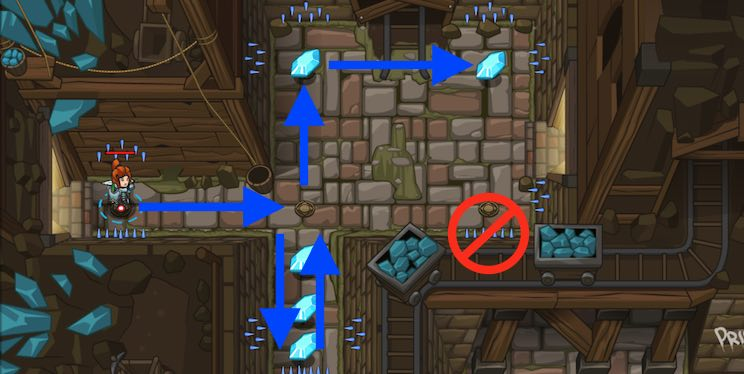

## _Gems in the Deep_

_In the right bottom of the screen you'll may see a squad of ogres chasing something or just in a hurry to beat you later._

#### _Legend says:_
> Quickly collect the gems; you will need them.

#### _Goals:_
+ _Avoid the spikes_
+ _Collect the gem_
+ _**Bonus**: Clean code (no warnings)_

#### _Topics:_
+ **Basic Sintax**

#### _Items we've got (- or need):_
+ Simple boots
+ _Optional: Elemental codex 1+_

#### _Solutions:_
+ **[JavaScript](gemsInTheDeep.js)**
+ **[Python](gems_in_the_deep.py "Top-10: 4s")**

> P.S.: There's a much faster solutions but they're require a premium heroes, upper levels and some special equipments. Unfortunately I don't have time to find fastest or less lines solutions by my self. So, be my guest %)

You are Welcome!

#### _Rewards:_
+ 11-16 xp
+ 18-27 gems

#### _Victory words:_
+ _YOU COMPLETED GEMS IN THE DEEP._

___

### _HINTS_



Remember how to move, it's important:

```javascript
hero.moveRight();
```

Can you remember the lessons from the last level? This will be the same, but you will need to move a lot more. Remember, `hero` refers to you, the hero.

When you move, you only move as far as the next movement square (look for the small tiles on the ground), so you might have to `moveUp` twice in a row to get to the top of this level from the bottom. 

Or you can pass a number as an **argument** to the movement command, to instruct your hero to move more than one space at a time.

For example, you can move up twice by typing:

```javascript
hero.moveUp(2);
```

___
