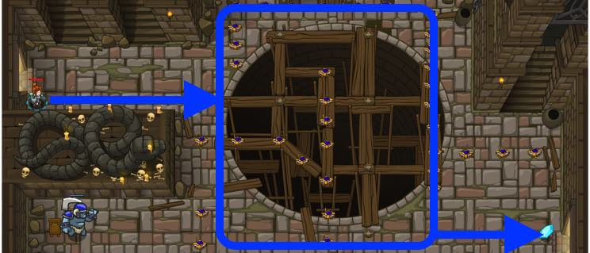

## _Enemy Mine_

#### _Legend says:_
> Tread carefully. Danger is afoot!

#### _Goals:_
+ _Avoid the fire traps!_
+ _Lure the ogre to its doom_
+ _Get the gem_
+ _Use 5 lines of code or less_

#### _Topics:_
+ **Basic Sintax**
+ **Arguments**

#### _Items we've got (- or need):_
+ Simple boots
+ _Optional: Elemental codex 1+_

#### _Solutions:_
+ **[JavaScript](enemyMine.js)**
+ **[Python](enemy_mine.py "#2 - 5.4s")**

#### _Rewards:_
+ 12 xp
+ 18 gems

#### _Victory words:_
+ _NICE MOVES!_

___

### _HINTS_



You can use arguments to optimize your code. Instead of:

```javascript
hero.moveRight();
hero.moveRight();
```

You can use:

```javascript
hero.moveRight(2);
```

The floor is littered with Fire Traps, but there's a safe path through to the gem.

When you call a method like `moveRight()` you can sometimes give extra information to the method to modify what it does. This extra information is referred to as arguments or parameters.

You can pass an argument to the `moveRight()` method like this: `moveRight(3)`. This tells `moveRight()` to make your hero move 3 spaces to the right instead of 1.

___
