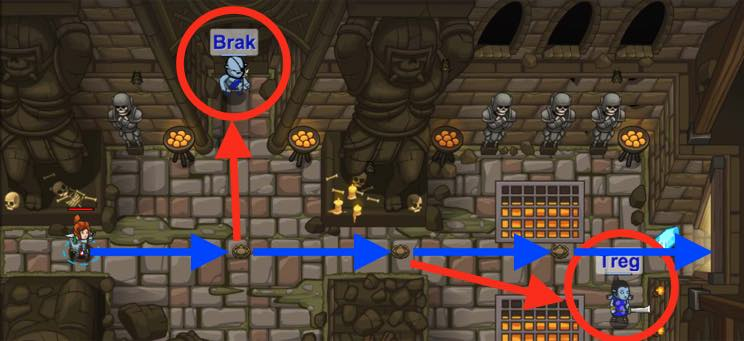

## _True Names_

#### _Legend says:_
> Learn an enemy's true name to defeat it.

#### _Goals:_
+ _Attack Brak twice (defeat is enough)_
+ _Collect the gem_
+ _Attack Treg twice (defeat is enough)_
+ _Your hero must survive_
+ _Bonus: Clean code (no warnings)_

#### _Topics:_
+ **Basic Sintax**
+ **Arguments**
+ **Strings**

#### _Items we've got (- or need):_
+ Simple boots
+ _Optional: Longrange weapon with enough damage_

#### _Solutions:_
+ **[JavaScript](trueNames.js)**
+ **[Python](true_names.py "#2 - 3.4s")**

#### _Rewards:_
+ 13-20 xp
+ 21-32 gems

#### _Victory words:_
+ _BRAK AND TREG HAVE LEARNED NOT TO MESS WITH YOU._

___

### _HINTS_



Be sure to attack each ogre twice.

Use the `attack` method to attack an enemy by their name (`"Name"`).

Capitalization is important!

Keep in mind a few things to beat this level:
1. You need to attack each ogre munchkin `twice` to defeat it.
2. Spell the names properly, with capitalization! `"Brak"` and `"Treg"`.
3. Put the names in quotes to make them into strings. Strings are a type of programming data. They represent text.
4. After you defeat `"Brak"` you should `moveRight()` to get the gem.
5. Then, defeat `"Treg"` by attacking them twice.
6. It's no problem if you die; you can always keep trying.

___

### _Attacking (Strings)_

Escaping the Dungeon of Kithgard is dangerous work. Sometimes a little muscle is required to break out!

By now, the `hero` has the `attack` method which is valuable when facing enemies toe-to-toe.

Check above an enemy's head for their name and **call** the `attack` method using the name **string** as an **argument**.

Munchkins in the Dungeon must be attacked **twice** to defeat them! You will need to call the method **twice**!

An example:

```javascript
hero.attack("Brak");
// You must attack twice to defeat munchkins:
hero.attack("Brak");
```

___
