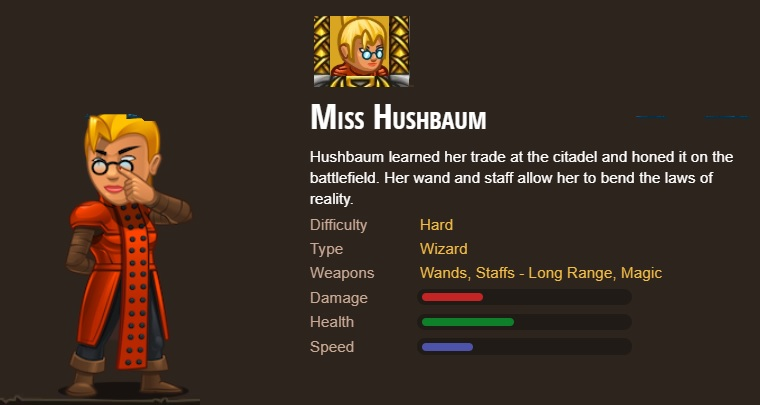
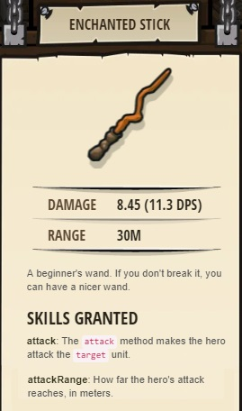
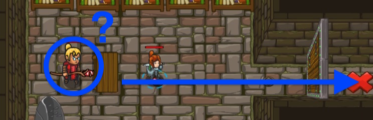

## _Kithgard Librarian_

#### _Legend says:_
> Seek help from a friendly Librarian!

#### _Goals:_
+ _Say the password_
+ _Move to the **X**_

#### _Topics:_
+ **Basic Sintax**
+ **Arguments**
+ **Strings**
+ **Reading the Docs**

#### _Items we've got (- or need):_
+ Simple boots

#### _Solutions:_
+ **[JavaScript](kithgardLibrarian.js)**
+ **[Python](kithgard_librarian.py "2.87s")**

#### _Rewards:_
+ 19 xp
+ 15 gems
+ Librerian hero

+ Enchanted Stick

#### _Victory words:_
+ _EVEN OGRES NEED A GOOD LIBRARIAN!_

___

### _HINTS_

Most levels have Hints that can help you when you're stuck.

Click **Next** to scroll through all the Hints for a level.

For this level, click 'Next' to find the password for the library door!

Most levels have hints that contain extra information to help you complete your goals and learn new concepts.

Like this:

**The password for the Library Door is `"Hush"`.**

> _Tip: use the `say()` command to say the password!_

> _Tip: Remember to use quotes around the password to make it a string, and use correct capitalization._

Be sure to check Hints on future levels if you're having trouble!

___
