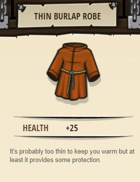

## _Loop Da Loop_

#### _Legend says:_
> Loops are a life saver!

#### _Goals:_
+ _Avoid the deadly lightning beam_
+ _Under 6 statements_

#### _Topics:_
+ **Basic Sintax**
+ **While Loops**

#### _Items we've got (- or need):_
+ Simple boots

#### _Solutions:_
+ **[JavaScript](loopDaLoop.js)**
+ **[Python](loop_da_loop.py)**

#### _Rewards:_
+ 23 xp
+ 18 gems
+ Thin Burlap Robe

#### _Victory words:_
+ _ROUND AND ROUND YOU GO._

___

### _HINTS_

You only need _one_ **while-true loop** containing **4 commands** to survive this level!

Double check your indentation!

Make sure the commands you add are **inside** the **while-true loop**.

___
