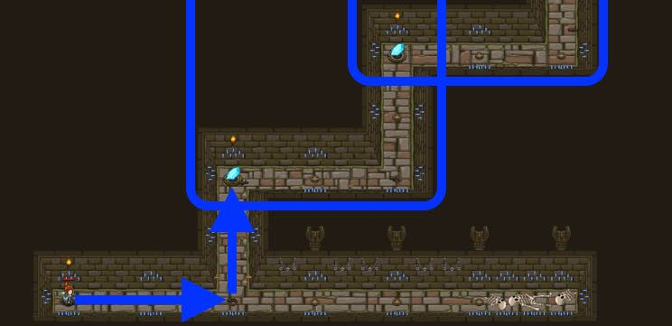

## _Haunted Kithmaze_

#### _Legend says:_
> A maze constructed to confuse travelers.

#### _Goals:_
+ _Your hero must survive_
+ _Navigate the maze_
+ _Under 6 statements_
+ _Bonus: clean code (no warnings)_

#### _Topics:_
+ **Basic Sintax**
+ **While Loops**

#### _Items we've got (- or need):_
+ Simple boots
+ _Optional: Elemental codex 1+_

#### _Solutions:_
+ **[JavaScript](hauntedKithmaze.js)**
+ **[Python](haunted_kithmaze.py "Top-15: 5,5s")**

#### _Rewards:_
+ 12-24 xp
+ 17-35 gems

#### _Victory words:_
+ _WHEN THE GOING GETS TOUGH, LOOP OVER IT._

___

### _HINTS_

Double check your indentation!

You only need **one while-true** containing **four** commands in this level.

Loops let you repeat the same code over and over. You can do this level in just four commands with a **while-true loop**.

_Tip: the hallway needs **two movements to the right**, and then **two movements up**. From there, you can just let the **while-true loop** repeat to do the rest._

Make sure that your movement commands are **inside the loop** so that they repeat!

___
