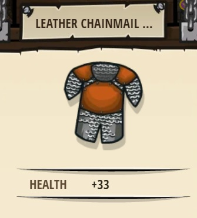

## _Radiant Aura_

#### _Legend says:_
> Skeletons. Fearsome, or fearful?

#### _Goals:_
+ _Collect the lightstones_
+ _Escape from the skeletones_

#### _Topics:_
+ **Basic Sintax**
+ **Arguments**
+ **While Loops**

#### _Items we've got (- or need):_
+ Simple boots
+ _Optional: Jumping boots_
+ _Optional: Elemental codex 1+_

#### _Solutions:_
+ **[JavaScript](radiantAura.js)**
+ **[Python](radiant_aura.py "#1 : 3,37s")**

#### _Rewards:_
+ 38 xp
+ 42 gems
+ Leather Chainmail Tunic

#### _Victory words:_
+ _OOH, SHINY!_

___

### _HINTS_

Lightstones scare undead, but only for a few seconds.

Skeletons are too tough to fight. The Lightstones can keep them away from you, but only for a little while!

_All you need to do is:_
+ Grab a Lightstone
+ Move past a skeleton
+ Repeat

___
