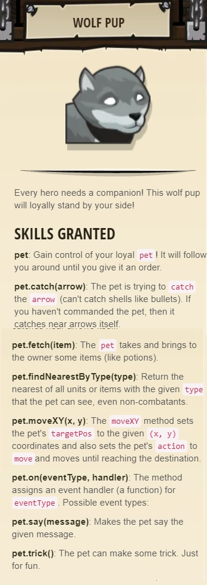

## _Dread Door_

#### _Legend says:_
> Behind a dread door lies a chest full of riches.

#### _Goals:_
+ _Destroy the door_
+ _Under 3 statements_
+ _Bonus: clean code (no warnings)_

#### _Topics:_
+ **Basic Sintax**
+ **Arguments**
+ **Strings**
+ **While Loops**

#### _Items we've got (- or need):_
+ Any weapon
+ _Option: Powerfull weapon_

#### _Solutions:_
+ **[JavaScript](dreadDoor.js)**
+ **[Python](dread_door.py)**

#### _Rewards:_
+ 14-28 xp
+ 20-40 gems
+ Wolf Pup



#### _Victory words:_
+ _BREAK DOWN YOUR FIRST DOOR._

___

### _HINTS_


You can use **while-true loops** with any methods like:

```javascript
while (true) {
    hero.moveRight();
    hero.attack("Brak");
}
```

You can combine **while-true loop** and `attack` to easily destroy things that take more then one hit. Like this door:

```javascript
while (true) {
    hero.attack("Door");
}
```

You can attack the door by its name, which is `"Door"`.

With looping and attacking, you can do this level in just two lines of code.

___
