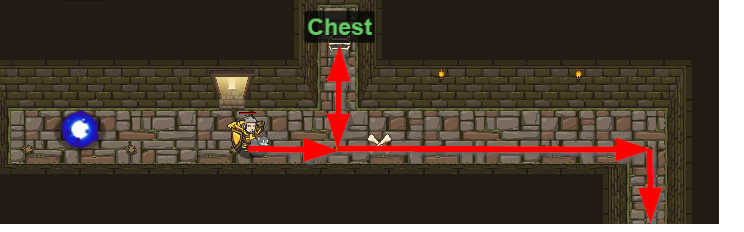

## _Hack and Dash_

#### _Legend says:_
> Escape the Dungeon Sprite with the help of a speed potion.

#### _Goals:_
+ _Escape the trap_

#### _Topics:_
+ **Basic Sintax**
+ **Arguments**
+ **Strings**
+ **While Loops**

#### _Items we've got (- or need):_
+ Simpla boots
+ _Optional: Elemental codex 1+_

#### _Solutions:_
+ **[JavaScript](hackAndDash.js)**
+ **[Python](hack_and_dash.py "#2 : 8,88s")**

#### _Rewards:_
+ 29 xp
+ 27 gems

#### _Victory words:_
+ _SIDE EFFECTS MAY INCLUDE DIZZINESS AND INSOMNIA._

___

### _HINTS_

There's danger in the air! You need to escape from the dungeon, but why not check that `"Chest"` before you go?
Use `attack()` it to open the `"Chest"`, then use a **while-loop** to escape.

You're not fast enough to outrun the Sprite without drinking the Speed Potion.

Before the **while-loop**, you'll want to `moveUp()` and attack the `"Chest"` then `moveDown()` back into the main hallway.

Inside the **while-loop** you'll want to `moveDown()`. Use an argument to  `moveDown()` multiple times wthout having write more lines of code.

Don't worry, the Sprite is activated by stepping on the X, so you'll have time to grab the potion!

___
