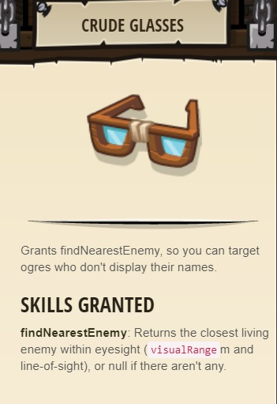
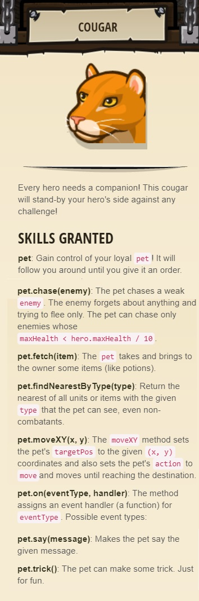
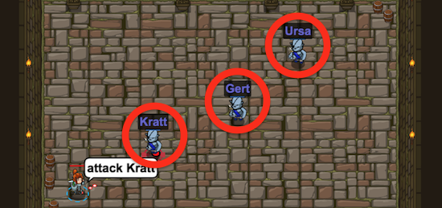

## _Known Enemy_

#### _Legend says:_
> Using your first variable to achieve victory.

#### _Goals:_
+ _Your hero must survive_
+ _Defeat the three ogres_
+ _Bonus: clean code (no warnings)_

#### _Topics:_
+ **Basic Sintax**
+ **Arguments**
+ **Strings**
+ **Variables**

#### _Items we've got (- or need):_
+ Boots
+ Weapon

#### _Solutions:_
+ **[JavaScript](knownEnemy.js)**
+ **[Python](known_enemy.py "2.8s")**

#### _Rewards:_
+ 19-38 xp
+ 27-41 gems
+ Crude Glasses



+ Cougar companion



#### _Victory words:_
+ _KEEP YOUR UNKNOWN ENEMIES CLOSER._

___

### _HINTS_



Declare a variable like this:

```javascript
var enemy1 = "Kratt";
```

When you use quotes: `"Kratt"`, you are making a **string**.

When you don't use quotes: `enemy1`, you are referencing the `enemy1` **variable**.

Up until now, you have been doing three things:
1. Calling **methods** (commands like `moveRight()`)
2. Passing **strings** (quoted pieces of text like "Treg") as arguments to the methods
3. Using **while-true loop** to repeat your methods over and over

Now you are learning how to use **variables**: symbols that represent data. The variable's value can **vary** as you store new data in it, which is why it's called a variable.

It's a pain to type the names of ogres multiple times, so in this level you use three variables to store the ogre names. Then when you go to attack, you can use the variable (`enemy1`) to represent the string that is stored in it (`"Kratt"`).

Declare variables like so:

```javascript
var enemy1 = "Kratt";
```

When you use quotes: `"Kratt"`, you are making a **string**.

When you don't use quotes: `enemy1`, you are referencing the `enemy1` **variable**.

___
