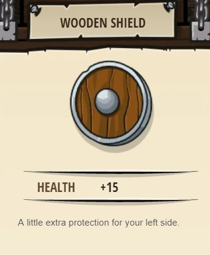
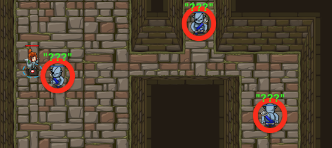

## _Master of Names_

#### _Legend says:_
> Use your new coding powers to target nameless enemies.

#### _Goals:_
+ _Your hero must survive_
+ _Defeat the three ogres_
+ _Bonus: clean code (no warnings)_

#### _Topics:_
+ **Basic Sintax**
+ **Arguments**
+ **Variables**

#### _Items we've got (- or need):_
+ Boots
+ Weapon
+ _Optional: good weapon_

#### _Solutions:_
+ **[JavaScript](masterOfNames.js)**
+ **[Python](master_of_names.py "9.1s")**

#### _Rewards:_
+ 20-30 xp
+ 29-43 gems
+ Wooden Shield



#### _Victory words:_
+ _SOON YOU WILL BE MASTER OF PROGRAMMING!_

___

### _HINTS_



Variables contain information to be referenced later. You can assign a new value to a variable any time you want.

Use `findNearestEnemy()` to target the nearest enemy.

```javascript
var closestEnemy = hero.findNearestEnemy();
```

Remember from the last level, **variables** are symbols that represent data. The variable's value can **vary** as you store new data in it, which is why it's called a variable.

Now instead of using the names of the enemies, you can use your glasses and the `findNearestEnemy()` method to store references to the ogres in variables. You don't need to use their names.

When you call the `findNearestEnemy()` method, you **must store the result in a variable**, like `enemy3` (you can name it whatever you want). The variable will remember what the nearest enemy **was** when you called the `findNearestEnemy()` method, so make sure to call it when you see a nearby enemy.

Remember: when you use quotes, like `"Kratt"`, you are making a **string**. When you don't use quotes, like `enemy1`, you are referencing the `enemy1` **variable**.

Ogre munchkins still take two hits to defeat.

___
