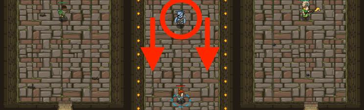

## _A Mayhem of Munchkins_

#### _Legend says:_
> Survive a neverending stream of ogres with mentorship from two experienced heroes!

#### _Goals:_
+ _Your hero must survive_
+ _Use a loop to defeat the ogres_
+ _Under 4 statements_

#### _Topics:_
+ **Basic Sintax**
+ **Arguments**
+ **Variables**
+ **While Loops**

#### _Items we've got (- or need):_
+ Weapon

#### _Solutions:_
+ **[JavaScript](aMayhemOfMunchkins.js)**
+ **[Python](a_mayhem_of_munchkins.py)**

#### _Rewards:_
+ 28-36 xp
+ 14-28 gems

#### _Victory words:_
+ _MAYHEM, MAYBE._

___

### _HINTS_



Use a **while-true loop** to fend off the attacking horde of munchkins.

Remember to use `findNearestEnemy()`:

```javascript
while (true) {
    var enemy = hero.findNearestEnemy();
}
```

In this level, you use a **while-true loop** to do two things:

+ First, use `findNearestEnemy()` to find an ogre. Remember to store the result in an `enemy` variable. Hover over the `findNearestEnemy()` method to see an example.
+ Then, `attack` using the `enemy` variable.

___
