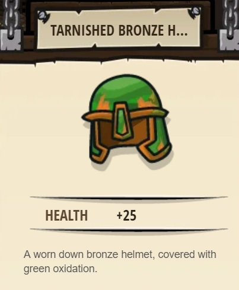

## _Closing the Distance_

#### _Legend says:_
> Some enemies will require different battle tactics.

#### _Goals:_
+ _Your hero must survive_
+ _Defeat the ogres_
+ _Grab the Gem_
+ _Bonus: no code problems_

#### _Topics:_
+ **Basic Sintax**
+ **Arguments**
+ **Variables**

#### _Items we've got (- or need):_
+ Simple boots
+ _Optional: Elementals codex 1+_
+ _Optional: Emperor's gloves_

#### _Solutions:_
+ **[JavaScript](theFinalKithmaze.js)**
+ **[Python](the_final_kithmaze.py "#2 - 4.2s")**

#### _Rewards:_
+ 23-35 xp
+ 32-48 gems
+ Tarnished Bronze Helmet

#### _Victory words:_
+ _A NEW ENEMY VANQUISHED._

___

### _HINTS_

Ogre throwers do much more damage than ogre munchkins.

Like in the last level, you can use the `findNearestEnemy` method from your glasses to store references to the ogres in variables.

When you call the `findNearestEnemy` method, you **must store the result in a variable**, like `enemy2` (you can name it whatever you want). The variable will remember what the nearest enemy **was** when you called the `findNearestEnemy` method, so make sure to call it when you see a nearby enemy.

Remember: when you use `findNearestEnemy`, you need to be in line of sight of an enemy, or you won't be able to see her.

This level introduces a new type of ogre, the ogre thrower, who does much more damage than the ogre munchkins you have been fighting. There are many more kinds of ogres awaiting you in future worlds.

___
