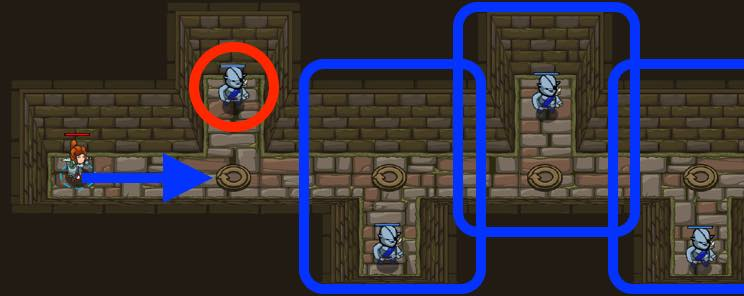

## _The Gauntlet B_

#### _Legend says:_
> Use all of your skills to survive the gauntlet.

#### _Goals:_
+ _Your hero must survive_
+ _Defeat all 4 ogres_
+ _Under 6 statements_

#### _Topics:_
+ **Basic Sintax**
+ **Arguments**
+ **Variables**
+ **While Loops**

#### _Items we've got (- or need):_
+ Simple boots
+ _Optional: Elementals codex 1+_
+ _Optional: Emperor's gloves_

#### _Solutions:_
+ **[JavaScript](theGauntletB.js)**
+ **[Python](the_gauntlet_b.py "#2 : 4.2s")**

#### _Rewards:_
+ 21 xp
+ 27 gems

#### _Victory words:_
+ _CRAWLING DUNGEONS?_

___

### _HINTS_

This level only needs **four** commands in a while-true loop.

With your powers of looping and variables, it should be no sweat to take down all these munchkins. In fact, with the **while-true loop**, you can do it in just five lines of code:

1. one to start the while-true loop,
2. one to move to where you can see an enemy,
3. one to store the nearest enemy into a variable,
4. and two to attack,
5. because munchkins take two hits with your current sword

___
