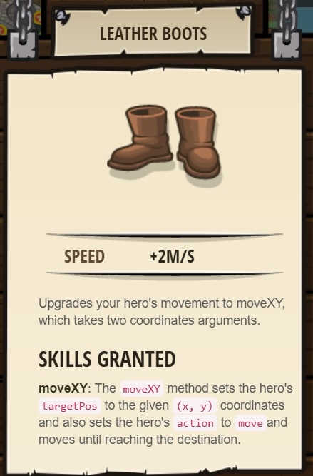
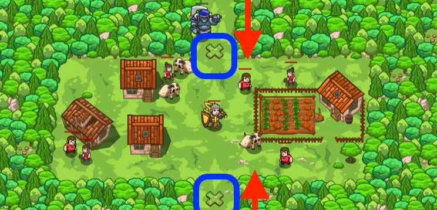

## _Defense of Plainswood_

#### _Legend says:_
> Protect the peasant village of Plainswood from the ogres.

#### _Goals:_
+ _Vilagers must survive_
+ _Bonus: clean code (no warnings)_

#### _Topics:_
+ **Basic Sintax**
+ **Arguments**
+ **Strings**
+ **Coordinate Pairs**

#### _Items we've got (- or need):_
+ Simple boots
+ _Optional: Elementals codex 1+_
+ _Optional: Emperor's gloves_

#### _Solutions:_
+ **[JavaScript](defenseOfPlainswood.js)**
+ **[Python](defense_of_plainswood.py "6s")**

#### _Rewards:_
+ 30-45 xp
+ 37-55 gems
+ Leather Boots



#### _Victory words:_
+ _PLAINSWOOD IS PROTECTED FROM OGRES._

___

### _HINTS_



Move your mouse cursor over a spot to find the `x` and `y` numbers of the location.

Remember how to build:

```python
hero.buildXY("fence", 40, 52)
```

___


Use your `buildXY` skills to build `"fence"`s and block out the ogres!

Remember to hover over the level map to find `x` and `y` coordinates for your `buildXY` method. In this case, you want to build on the X marks at `40, 52` and `40, 20`.

It is much, much easier to do this level by building type `"fence"` than by building type `"fire-trap"`.

___
