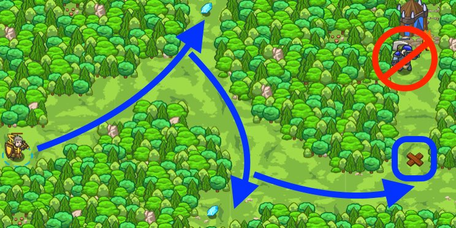

## _Winding Trail_

#### _Legend says:_
> Stay alive and navigate through the forest!

#### _Goals:_
+ _Your hero must survive_
+ _Get to the end of the path_
+ _Bonus: Grab 2 gems_
+ _Bonus: Grab all 6 gems_

#### _Topics:_
+ **Basic Sintax**
+ **Arguments**
+ **Strings**

#### _Items we've got (- or need):_
+ Simple boots
+ _Optional: Elementals codex 1+_
+ _Optional: Emperor's gloves_

#### _Solutions:_
+ **[JavaScript](windTrail.js)**
+ **[Python](wind_trail.py "#1 - 8.47s")**

#### _Rewards:_
+ 31-55 xp
+ 38-68 gems
+ Programmaticon II


#### _Victory words:_
+ _YOU'VE MADE THE FOREST A SAFER PLACE._

___

### _HINTS_

Move to each gem in turn, then stop the ogre from getting you by building a fence on the X marker! 



Just like building, you can now move to any position on the map using `moveXY(x, y)`. Mouse over where you want to go to get the `x` and `y` coordinates, then use:

```javascript
hero.moveXY(30, 30);
```
to move there.

___

Forget those old simple `moveRight` boots!

Your new digs let you `moveXY` for continuous movement, wherever you want to go. They even have pathfinding built in. Sweet, huh?

Just like with `buildXY`, you can hover over the level to find `x` and `y` coordinates for you to move to.

Check out the bonus achievements on this level for grabbing extra gems if you want an extra challenge.

___
