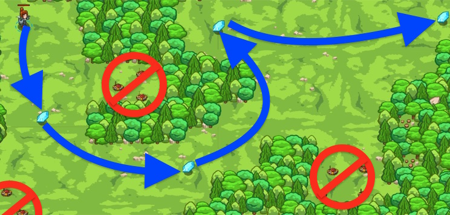

## _One Wrong Step_

#### _Legend says:_
> Mines, and gems, and a bear! Navigate the forest and watch your step.

#### _Goals:_
+ _Gather all the gems_
+ _Get to the exit_

#### _Topics:_
+ **Basic Sintax**
+ **Arguments**

#### _Items we've got (- or need):_
+ Fast boots
+ _Optional: Elementals codex 1+_

#### _Solutions:_
+ **[JavaScript](oneWrongStep.js)**
+ **[Python](one_wrong_step.py "#1 - 4.88s")**

#### _Rewards:_
+ 47 xp
+ 30 gems

#### _Victory words:_
+ _MORE LIKE FOUR WRONG STEPS, AMIRITE?_

___

### _HINTS_



Code can be changed! One's destiny is not defined merely by the sample code provided.

```javascript
hero.moveXY(26, 43); // Danger ahead! Erase the coordinates and move towards the gems instead.
```

Navigate through the forest and gather gems on your way!

**Watch out!** _The default code was written by an ogre that wants you to run into mines! Edit the coordinates so the hero moves to each gem. You must collect each gem to win!_

___
