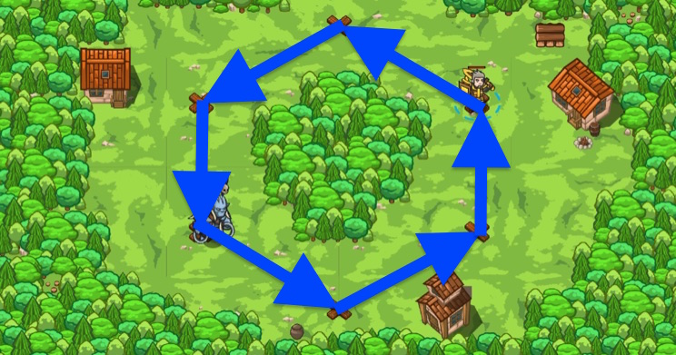

## _Forest Evasion_

#### _Legend says:_
> A headhunter has heard of the hero's harrowing tale and has come to claim their head!

#### _Goals:_
+ _Avoid the headhunter_

#### _Topics:_
+ **Basic Sintax**
+ **Arguments**
+ **While Loops**

#### _Items we've got (- or need):_
+ _Optional: Emperor's gloves_

#### _Solutions:_
+ **[JavaScript](forestEvasion.js)**
+ **[Python](forest_evasion.py)**

#### _Rewards:_
+ 47 xp
+ 31 gems

#### _Victory words:_
+ _HE'LL GET TIRED SOON, RIGHT?_

___

### _HINTS_

Use a `while-true` loop and `moveXY` to stay out of the eyesight of the Headhunter.

The deadly headhunter is coming for your hero's head! Use `moveXY` to move around the group of trees and stay out of sight. The headhunter can't attack you if he doesn't see you!

___
