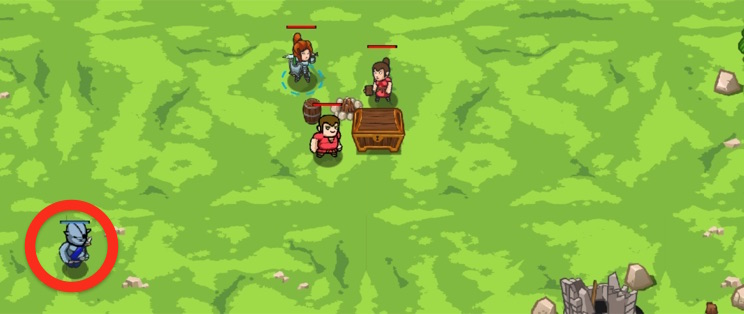

## _Picnic Buster_

#### _Legend says:_
> Protect the picnickers from patrolling ogres.

#### _Goals:_
+ _All humans must survive_
+ _No code problems_

#### _Topics:_
+ **Basic Sintax**
+ **Arguments**
+ **Variables**
+ **If Statements**
+ **While Loops**

#### _Items we've got (- or need):_
+ Weapon

#### _Solutions:_
+ **[JavaScript](pBust.js)**
+ **[Python](p_bust.py)**

#### _Rewards:_
+ 53 xp
+ 33 gems

#### _Victory words:_
+ _THE ONLY THING WORSE THAN OGRES AT A PICNIC IS ANTS._

___

### _HINTS_



Protect the picnickers by using `if` statements to figure out when there are ogres to attack.

`if`-statements are fundamental tool for programmers. They look like this:

```javascript
var enemy = hero.findNearestEnemy();
if (enemy) {
    hero.attack(enemy);
}

```

Just as in **Patrol Buster** level, you want to attack the nearest enemy, but only if there is one. Use an `if` statement with `enemy` as the condition to do that.

___
