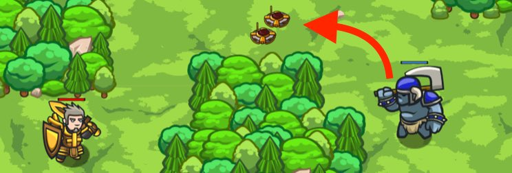

## _Thumb Biter_

#### _Legend says:_
> Use your best insults–ogres are thick-skinned.

#### _Goals:_
+ _Lure the ogre to his doom_

#### _Topics:_
+ **Basic Sintax**
+ **Arguments**
+ **Strings**
+ **If Statements**
+ **Boolean Equality**
+ **Arithmetic**

#### _Items we've got (- or need):_
+ Weapon

#### _Solutions:_
+ **[JavaScript](thumbBiter.js)**
+ **[Python](thumb_biter.py)**

#### _Rewards:_
+ 32-48 xp
+ 39-58 gems

#### _Victory words:_
+ _HE PROBABLY BIT HIS THUMB AT YOU FIRST._

___

### _HINTS_



Use the equality operator (`==`) to check if both sides match.

```javascript
if(2 + 2 == 4) {
    hero.say("2 + 2 equals 4!"); // Happens all the time, because 2 + 2 is 4!
}
if(2 + 3 == 4) {
    hero.say("2 + 3 equals 4!"); // Will never happen, because 2 + 3 isn't 4!
}
```

To beat this level, you must make two `if-statement` conditionals `true`.

```javascript
if (3 + 3 == 6) {
    hero.say("Come at me!");
}
```

Change the next condition as well:

```javascript
if (20 == 20) {

}
```

Finally, say one last insult to make the Ogre upset!

___

This level introduces many new things.

In order to succeed, you need to fix the `if` statements so that your hero says things to the ogre to trick him into the mines. 

The block of code the `if` controls (its body) will only run if the condition (the mathy bit) works out to be True.

Enough working `if`s and the ogre will blunder into the mines trying to get at you!

___
