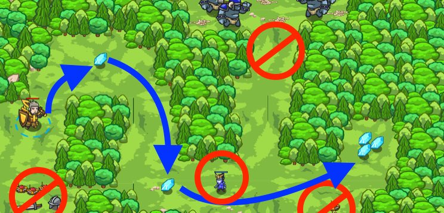

## _Gems or Death_

#### _Legend says:_
> Use if-statements to decide: do you want gems, or do you want death?

#### _Goals:_
+ _Grab all the Gems_
+ _Bonus: cleen code (no warnings)_

#### _Topics:_
+ **Basic Sintax**
+ **Variables**
+ **If Statements**
+ **Arithmetic**
+ **Boolean Equality**
+ **Boolean Greater/Less**

#### _Items we've got (- or need):_
+ Fast boots
+ _Optional: Elemental codex 1+_

#### _Solutions:_
+ **[JavaScript](gemsOrDeath.js)**
+ **[Python](gems_or_death.py "#1 - 4.5s")**

#### _Rewards:_
+ 34-51 xp
+ 40-60 gems

#### _Victory words:_
+ _UH, DEATH, PLEASE. NO, GEMS! GEMS! GEMS, SORRY. SORRY..._

___

### _HINTS_



Make the `if`-statement `true` for the commands you want to execute, and `false` for the commands you don't want to execute.

Remember the `==` operator means "is equal to".

`1 + 2 == 3` is `true`.
`3 + 3 == 5` is `false`.

In this level you need to fix each of the `if-statement`s to do as the comment says!

Read the comments carefully and fix the `if-statement`s accordingly.

___

This level is all about the `if` statement. As a matter of fact, you don't have to write any code at all. Your job is debugging.

All you have to do is fix the `if` statements so that the actions you want your hero to take happen and the ones you don't want don't happen.

The block of code the `if` controls (its body) will only get run if the condition (the mathy bit) works out to be true.

Let's take for example the first `if`:

```javascript
if (1 + 1 + 1 == 3) {
    hero.moveXY(5, 15);  // Move to the first mines
}
```

Since `1 + 1 + 1` does equal `3` it is true. So, off into the mines we run...

If you don't want to die, change either the `1 + 1 + 1` or the `3` so that it is no longer true (further down in the code you will see that you can also change the `==`).

Then continue with each `if` statement, making it true or false depending on whether or not you wish its body to happen.

___
