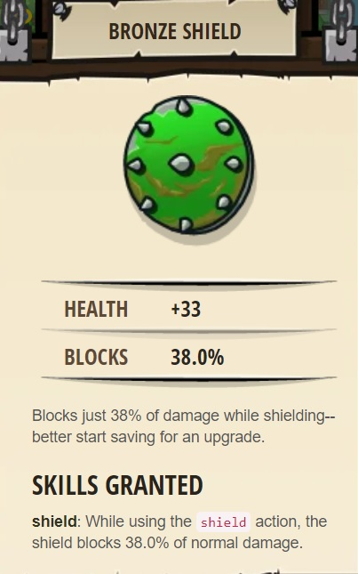
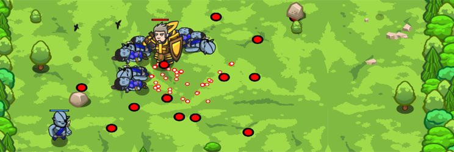

## _Woodland Cleaver_

#### _Legend says:_
> Use your new cleave ability to fend off munchkins.

#### _Goals:_
+ _Fend off the ogres_
+ _Bonus: clean code (no warnings)_

#### _Topics:_
+ **Basic Sintax**
+ **Strings**
+ **Variables**
+ **While Loops**
+ **If Statements**
+ **If/else Statements**

#### _Items we've got (- or need):_
+ Long sword
+ Wristwatch

#### _Solutions:_
+ **[JavaScript](woodland.js)**
+ **[Python](woodland.py)**

#### _Rewards:_
+ 38-57 xp
+ 46-69 gems
+ Bronze Shield



#### _Victory words:_
+ _EVER CONSIDERED BECOMING A LUMBERJACK?_

___

### _HINTS_



You have a new sword with the method `cleave()`, and a new watch with the method `isReady()`.

`cleave()` is a special attack that hits all nearby enemies, but it can only be used every so often.

Before you `cleave()`, check if it's ready:

```javascript
if(hero.isReady("cleave")) {
    hero.cleave(enemy);
} else {
    hero.attack(enemy);
}
```

The woods are swarming with ogre munchkins, but you have a new Long Sword, and its `cleave` ability will make short work of them! `cleave` hits every enemy within ten meters of your hero.

Special abilities like `cleave` have cooldown periods, which means you can't use them all the time. (You can only cleave every ten seconds.) You need to check if they are ready to use first. Fortunately, your Sundial Wristwatch gives you the `isReady` method. It tells you whether special abilities are ready to be used yet.

Putting everything together, your code should go like this:

+ loop
    + find an enemy
    + _if_ `"cleave"` is ready, _then_
        + cleave the enemy
    + _else_
        + attack the enemy

Hover over the `isReady` and `cleave` documentation in the lower right to see the syntax for how to use them.

___
