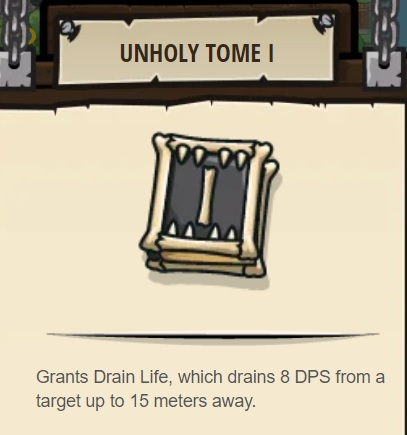

## _Arcane Ally_

#### _Legend says:_
> Stand your ground against large ogres with a new hero: Ms. Hushbaum.

#### _Goals:_
+ _Survive the ogre onslaught_

#### _Topics:_
+ **Basic Sintax**
+ **Arguments**
+ **Variables**
+ **While Loops**
+ **If Statements**

#### _Items we've got (- or need):_
+ Long Sword
+ Shield

#### _Solutions:_
+ **[JavaScript](arcane.js)**
+ **[Python](arcane.py)**

#### _Rewards:_
+ 74 xp
+ 84 gems
+ **Unholy Tome I**

#### _Victory words:_
+ _YOU CAN NOW PURCHASE HUSHBAUM IN THE HERO SHOP._

___

### _HINTS_

Challenge level! If you can defeat this many ogre munchkins, you'll unlock few wizard specific levels where you can learn some their abilities.

Check you equipment and armor. You need something better than the bronze old set.

Make sure that you have enough armor to defeat the ogres. You will probably need more than 300 health to survive. If you don't have enough, come back later when you've earned more gems.

It's a straight-up brawl between you and the ogres, no tricks required, just sheer might.

___
