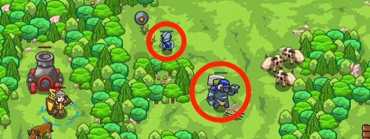

## _Range Finder_

#### _Legend says:_
> Find the distance to targets. Artillery will do the rest!

#### _Goals:_
+ _Defeat the ogres_

#### _Topics:_
+ **Basic Syntax**
+ **Arguments**
+ **Strigns**
+ **Variables**

#### _Items we've got (- or need):_
+ None

#### _Solutions:_
+ **[JavaScript](rangeFinder.js)**
+ **[Python](range_finder.py)**

#### _Rewards:_
+ 70 xp
+ 39 gems

#### _Victory words:_
+ _WOE TO THE FOE BELOW AN ARTILLERY SHELL!_

___

### _HINTS_



Use `distanceTo()` to find the range to each enemy, and use `say()` to call the range for your artillery.

Then sit back and watch the fireworks.

```javascript
hero.say(distance2);

var distance4 = hero.distanceTo(enemy4);
```

You've been asked to test special glasses that can see through trees! This time, you don't need to go out and deal with the ogres personally.

Your artillery can't sight through the trees, so use `distanceTo()` and `say()` to call out the range to each target.

Be careful, though! There are peaceful woodsmen living in these woods.

___
