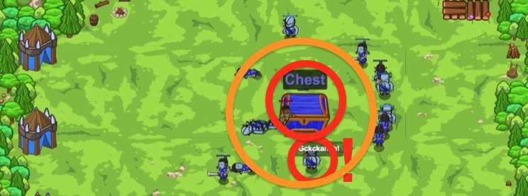

## _Maniac Munchkins_

#### _Legend says:_
> Defend yourself while munchkins attack! Break open a chest and take the spoils.

#### _Goals:_
+ _Break open the chest_
+ _Stay alive_

#### _Topics:_
+ **Strings**
+ **Variables**
+ **While Loops**
+ **If Statements**
+ **If/else Statements**
+ **Nested If Statements**

#### _Items we've got (- or need):_
+ Weapon
+ Glasses

#### _Solutions:_
+ **[JavaScript](maniac.js)**
+ **[Python](maniac.py)**

#### _Rewards:_
+ 77 xp
+ 44 gems

#### _Victory words:_
+ _HAI-KIBA!_

___

### _HINTS_



Break open a chest while being attacked by groups of munchkins and certain, particularly angry, munchkins.

```javascript
if (condition1) {
    // This only happens if condition1 is true.
} else if (condition2) {
    // This only happens if condition1 is false and condition2 is true.
} else {
    // This only happens if both condition1 and condition2 are false.
}
```

You can attack something using its name. In this case don't forget about quotes: `hero.attack("Sauron")`.

___

In this level, the munchkins will periodically attack without the support of their comrades!

USe `cleave` to defeat any groups of munchkins that get close, but only use it when it's off cooldown! `isReady` will help with that.

```javascript
if (hero.isReady("cleave")) {
    // This will only happen when the hero's "cleave" is ready to be used.
}
```

Check if munchkins get to close using the `distanceTo` method. Remember that `distanceTo` finds a **number** between the hero and the argument.

Note that the **less-than** sign, or `<` is only useful at comparing two **numbers!** `hero.findNearestEnemy()` returns an enemy, not a number! `hero.isReady()` returns a `true` or `false` value, not a number! Be sure to only use `<` when comparing 2 numbers, like `5` or `hero.distanceTo(enemy)`

```javascript
var enemy = hero.findNearestEnemy();
var distance = hero.distanceTo(enemy);

if (hero.isReady("cleave")) {
    // else if is a special term! It tells the hero to not do the next part if the first part was true, or tells the to do the second part if the first part wasn't true.
} else if (distance < 5) {
    // This will only happen when the enemy is closer than 5 meters and cleave isn't ready.
}
```

Finally, if cleave isn't ready and the nearest munchkin is more than 5 meters away, you're free to attack the chest!

```javascript
// Remember that else only happens when the other if statements were false
else {
    // This will only happen when there isn't an enemy closer than 5 meters and cleave isn't ready.
}
```

___
