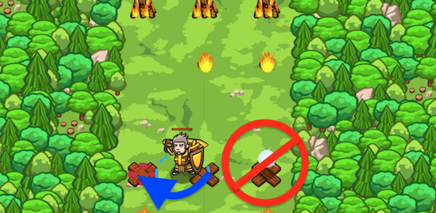

## _Forest Fire Dancing_

#### _Legend says:_
> Only agile heroes can pass! Use nested if statements to dodge the fireballs.

#### _Goals:_
+ _Avoid the fireballs_

#### _Topics:_
+ **Variables**
+ **While Loops**
+ **If Statements**
+ **If/else Statements**
+ **Nested If Statements**
+ **Accessing Properties**

#### _Items we've got (- or need):_
+ Weapon
+ Glasses

#### _Solutions:_
+ **[JavaScript](forestDance.js)**
+ **[Python](forest_dance.py)**

#### _Rewards:_
+ 68 xp
+ 41 gems

#### _Victory words:_
+ _ONLY YOU CAN PREVENT FOREST FIRES._

___

### _HINTS_

You can nest an `if` statement inside another `if` statement to make more complex choices.

Use the technique to find the safe spot and avoid the fireballs!

This situation might remind you of a previous level, Fire Dancing, but in this level, you have to dodge  _two_ fireballs at a time! On top of that, the fireballs are randomized, so you can't just go left and right in a loop. The logic for deciding where you can safely go is a little tricky:
+ If you see a gem on one side of the map, move _away_ from it to the other side;
+ If there's no gem, move to the center.

___
