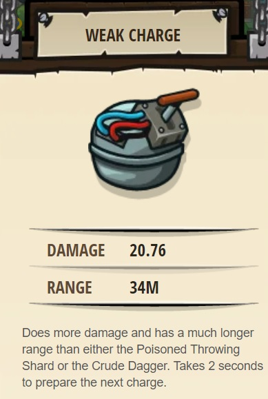
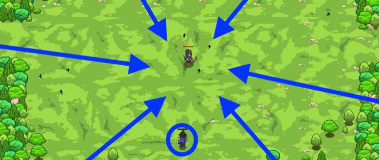

## _Swift Dagger_

#### _Legend says:_
> Deal damage from a distance with your new hero.

#### _Goals:_
+ _Your hero must survive the ogre rush_

#### _Topics:_
+ **Variables**
+ **While Loops**
+ **If Statements**
+ **If/else Statements**
+ **Nested If Statements**
+ **Accessing Properties**

#### _Items we've got (- or need):_
+ Dagger
+ Crossbow

#### _Solutions:_
+ **[JavaScript](swiftDag.js)**
+ **[Python](swift_dag.py)**

#### _Rewards:_
+ 82 xp
+ 90 gems
+ **Weak Charge**

#### _Victory words:_
+ _CAN'T TOUCH THIS!_

___

### _HINTS_

With your upgraded glasses, you can use `distanceTo` to measure the distance, in meters, to a target unit or position. In this level, you'll use that to throw your dagger at munchkins that come within throw range.

You'll need to use the **less-than** operator `<`.

You can read it like this: _if_ the distance is _less than_ your `throwRange`, _then_ throw your dagger at the enemy, _else_ attack the enemy with your bow.

Hover over the `throw` docs to see how to use your thrown dagger attack. The dagger has a short `throwRange` of 15m, so you only want to use it when the enemies are very close.

If you get stuck, try doing Peasant Protection and Munchkin Swarm to apply what you learned.

___
