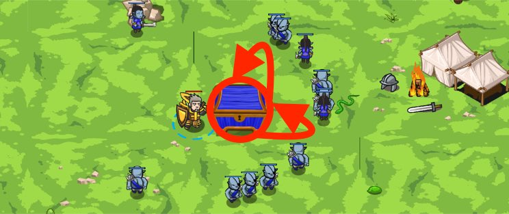

## _Munchkin Swarm_

#### _Legend says:_
> Loot a gigantic chest while surrounded by a swarm of ogre munchkins.

#### _Goals:_
+ _Break open the chest_
+ _Stay alive_

#### _Topics:_
+ **Strings**
+ **Variables**
+ **While Loops**
+ **If Statements**
+ **If/Else Statements**
+ **Boolean Greater/Less**

#### _Items we've got (- or need):_
+ Book of Life 1

#### _Solutions:_
+ **[JavaScript](swarm.js)**
+ **[Python](swarm.py)**

#### _Rewards:_
+ 86 xp
+ 71 gems

#### _Victory words:_
+ _THE OGRES ARE BEGINNING TO FEAR YOU!_

___

### _HINTS_



The ingredients to beat this level are: `if/else`, `distanceTo()`, `<`, `cleave()`, `while-true` loop, and `attack("chest")`. Put them all together to break the chest and suvive the Munchkin onslaught.

```javascript
// Check the distance to the nearest enemy.
var enemy = hero.findNearestEnemy();
var distance = hero.distanceTo(enemy);

if (distance < 10) {
    hero.cleave();
} else {

}
```

In this level, you put together everything you've learned over the past few levels in order to use `if/else`, `distanceTo`, `<`, and `cleave` to defeat vast numbers of ogre munchkins while looting a giant treasure chest.

These munchkins have become suitably terrified of you and your mighty Long Sword, so they will only approach when there are a lot of them together in a pack. Check the distance to the nearest munchkin and only `cleave` if the munchkin is closer than `10` meters. Use an `else` clause to attack the `"Chest"` otherwise.

_**Tip**: make sure to use a **while-true loop**_

_**Tip**: you'll know that your distance check is working when your hero never chases any munchkins away from the chest._

___
