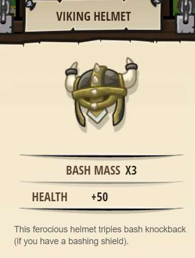

## _Lost Viking_

#### _Legend says:_
> Locate the Lost Viking's treasure, hidden in a deadly maze! If you're new to programming, come back to this one later.

#### _Goals:_
+ _Get to the end of the maze alive_

#### _Topics:_
+ **Variables**
+ **While Loops with Conditionals**
+ **If Statements**
+ **Accessing Properties**
+ **Boolean Greater/Less**
+ **Array Indexes**

#### _Items we've got (- or need):_
+ Boots

#### _Solutions:_
+ **[JavaScript](viking.js)**
+ **[Python](viking.py)**

#### _Rewards:_
+ 50 xp
+ 40 gems
+ **Viking Helmet**



#### _Victory words:_
+ _I THINK THOSE BURLS ARE WATCHING YOU_

___

### _HINTS_

Legend tells of a Viking warrior who discovered a map that was supposed to lead to a secret treasure trove of arcane knowledge. 
According to the story, the map depicted an island filled with dense forest, strange creatures, and deadly traps.
The viking claimed to have discovered the location of the island, and sailed away to retrieve the treasure. He was never seen again.

Look into Hints to get instructions.

___

#### Lost Viking

Legend tells of a Viking warrior who discovered a map that was supposed to lead to a secret treasure trove of arcane knowledge. According to the story, the map depicted an island filled with dense forest, strange creatures, and deadly traps. The viking claimed to have discovered the location of the island, and sailed away to retrieve the treasure. He was never seen again.

The map described the way to find the treasure like this:

##### _Start_

Start at the **Red X** (this is at the 0,0 coordinate of the map).

##### _Maze Parameters_

You should use three configurable _maze parameters_ called `SLIDE`, `SKIP`, `SWITCH`. For the following examples, we use these values to describe the rules:

```python
SLIDE = 10
SWITCH = 7
SKIP = 11
```

##### _Moving East_

Step 35 paces due east (along the X axis), counting your `steps`. You will never go west along the X axis, only east.


##### _Moving North-South_

For each `step` east you take, you must also `sideStep` one pace to the north (along the Y axis).

Since `SWITCH = 7`, when the number of `steps` you have taken  is divisible by `7` you **SWITCH** to `sideStep`ing south instead of north. (The 7th step will be to the north, the 8th to the south, then keep `sideStep`ing south until you hit another **SWITCH**).

Since `SKIP = 11` when the number of `steps` you have taken is divisible by `11`, you must `sideStep` TWICE for that step (this is called **SKIP**ing).


##### _Boundaries_

You must stay within `1` to `10` `sideSteps` north of the **Red X**. (The `10` is indicated by the `SLIDE = 10` maze parameter!)

If you are about to take a `sideStep` greater than `10`, you should instead **SLIDE** south to `1` `sideStep` north of the **Red X**. In other words, you _wrap_ around back to `sideSteps = 1`.

If you are about to take a `sideStep` less than `1`, you should instead `SLIDE` north to `10` `sideStep`s north of the **Red X**. In other words, you wrap around to `sideSteps = 10`.


##### _The Catch_

The island's layout is different for each traveler who lands on it! The values given for:

```python
SLIDE = 10
SWITCH = 7
SKIP = 11
```

...may change. You should be prepared for your maze to use different values for these numbers. A helpful raven will inform you what the values should be, so keep an eye out for the raven, then change your maze parameters to match!

##### _The Reward_

If you are able to solve this puzzle, you will be rewarded with the **Lost Viking's helm**, as well as given access to the secret treasure trove of arcane knowledge!

___
