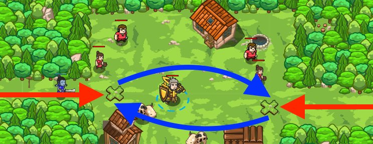

## _Village Rover_

#### _Legend says:_
> Patrolling the village can get repetitive... functions make it easier!

#### _Goals:_
+ _Stop all the ogres_
+ _Save all the peasants_

#### _Topics:_
+ **Basic Syntax**
+ **Arguments**
+ **Variables**
+ **While Loops**
+ **If Statements**
+ **Functions**

#### _Items we've got (- or need):_
+ Weapon to one-shot munchkins
+ **No Ring of Speed**

#### _Solutions:_
+ **[JavaScript](villageRover.js)**
+ **[Python](village_rover.py)**

#### _Rewards:_
+ 79 xp
+ 45 gems

#### _Victory words:_
+ _BE SEEING YOU!_

___

### _HINTS_



Patrolling the village can be boring and repetitive.

Using **Functions** makes repeating the same task easier. You can turn many lines of code into just one!

```javascript
// Define a function
function findAndAttackEnemy() {
    var enemy = hero.findNearestEnemy();
    if (enemy) {
        hero.attack(enemy);
    }
};

// Now just one line can be used in place of all that code
findAndAttackEnemy();
```

___
