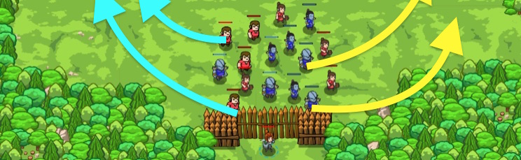

## _Friend and Foe_

#### _Legend says:_
> A brawl in the woods! Pick out friend from foe and prepare for a battle.

#### _Goals:_
+ _Rally the troops_

#### _Topics:_
+ **Basic Syntax**
+ **Strings**
+ **Variables**
+ **While Loops**
+ **If Statements**
+ **Accessing Properties**

#### _Items we've got (- or need):_
+ Long Sword

#### _Solutions:_
+ **[JavaScript](friendAndFoe.js)**
+ **[Python](friend_and_foe.py)**

#### _Rewards:_
+ 66 xp
+ 71 gems

#### _Victory words:_
+ _WHAT A RIOT!_

___

### _HINTS_



You can combine two strings into one using the the `+` operator.

This is called concatenating strings.

```javascript
hero.say("To battle, " + "Sally!");
```

This will cause your hero to say `"To battle, Sally!"`.

You can also concatenate strings stored in variables:

```javascript
hero.say("To battle, " + peasant.id);
```

Use `hero.findNearestEnemy` to store the nearest enemy in variable.

```javascript
var enemy = hero.findNearestEnemy();
```

Use an `if`-statement to check if the variable contains an enemy:

```javascript
if (enemy) {

}
```

If an enemy exists, concatenate the enemy's name using their `id` property and another string!

___

Just like numbers can be added together using `+`, strings also can make use of the + operator.

If you have two strings `"foo"` and `"bar"`, what do you expect the result of `"foo" + "bar"` to be?

It's very simple, in fact, as `"foo" + "bar"` is the same as `"foobar"`! It simply combines (or `concatenates`) the two strings together.

In this level you will need to command peasants to battle and peons to go away by combining their `id` with another string.

Commanding peasants has be shown to you:

```javascript
hero.say("To battle, " + peasant.id + "!");
// This results in somethin like: "To battle, Sally!"
```

Please note, peons and peasants don't like it when you simply call their name! You need to add (or `concatenate`) something to the strings to get them to act.

___
