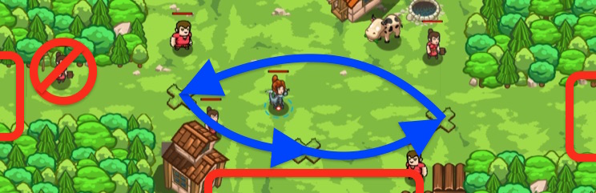

## _Village Champion_

#### _Legend says:_
> Write your own function to stop the ogre invasion.

#### _Goals:_
+ _Stop all the ogres_
+ _Save all the peasants_
+ _Define a function in your code_

#### _Topics:_
+ **Strings**
+ **Variables**
+ **While Loops**
+ **If Statements**
+ **If/Else Statements**
+ **Nested If Statements**

#### _Items we've got (- or need):_
+ Long Sword
+ **Do not use Ring of Speed**

#### _Solutions:_
+ **[JavaScript](villageChamp.js)**
+ **[Python](village_champ.py)**

#### _Rewards:_
+ 79 xp
+ 45 gems

#### _Victory words:_
+ _ARISE, MY CHAMPION!_

___

### _HINTS_



The ogres have broken through and opened another path into the village! You'll need to write your own function to handle this new attack.

Look closely at how to define a function. You're on your own this time!

```javascript
function findAndAttackEnemy() {
    var enemy = hero.findNearestEnemy();
    if (enemy) {
        hero.attack(enemy);
    }
}
```

___

In this level you need to define your own function to fight off the ogres. This function should combine the cleaving and attacking logic from **Village Warder** into one. Go back and look at that level to remind yourself how to define a function.

The code for cleaving and attacking requires some nested `if/else` statements. Go back and look at **Stillness in Motion** and **The Agroppa Defense** to remind yourself how to structure your logic.

Remember how to define a function:

```javascript
function sayHello() {
    hero.say("Hello!");
}
```

Also, remember that when you call a function you _don't_ add `hero` to it, because the function is defined by _you_, not the hero.

```javascript
sayHello();
hero.say("Goodbye.");
```

___
