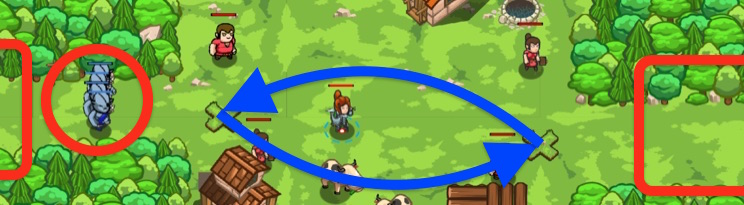

## _Village Warder_

#### _Legend says:_
> Define more functions to defend against stronger attacks.

#### _Goals:_
+ _Stop all the ogres_
+ _Save all the peasants_

#### _Topics:_
+ **Strings**
+ **Variables**
+ **While Loops**
+ **If Statements**
+ **Nested If Statements**
+ **Functions**

#### _Items we've got (- or need):_
+ Long Sword
+ **Do not use Ring of Speed**

#### _Solutions:_
+ **[JavaScript](villageWand.js)**
+ **[Python](village_wand.py)**

#### _Rewards:_
+ 79 xp
+ 45 gems

#### _Victory words:_
+ _WELL WARDERED._

___

### _HINTS_



The village is under attack by an even bigger horde of Ogres! You'll need to use functions to attack _and_ to cleave against this onslaught.

```javascript
function findAndAttackEnemy() {
    var enemy = hero.findNearestEnemy();
    if (enemy) {
        hero.attack(enemy);
    }
}
```

In this level you'll be writing the _definition_ of a function so that you can _call_ it in your main loop. Because the Ogres might attack in larger waves, you'll need to add a function that uses your Cleave ability.

When you define your `findAndCleaveEnemy` function, remember to check that: 1. the enemy exists; and 2. that your Cleave ability is ready to use.

Be sure to remember how to define a function:

```javascript
function sayHello() {
    hero.say("Hello!");
}
```

Remember that when you call a function you _don't_ add `hero` to it, because the function is defined by _you_, not the hero.

```javascript
sayHello();
hero.say("Goodbye.");
```

___
