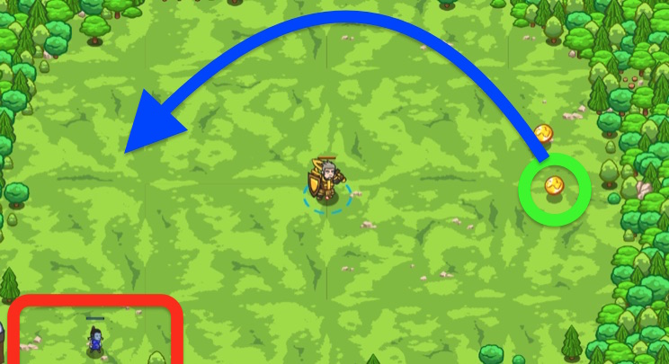

## _A Fine Mint_

#### _Legend says:_
> Ogre Peons are trying to steal your coins! Don't let them snag your rightful earnings!

#### _Goals:_
+ _Defeat the peons_
+ _Collect the coins_

#### _Topics:_
+ **Basic Syntax**
+ **Variables**
+ **While Loops**
+ **If Statements**
+ **Accessing Properties**
+ **Functions**

#### _Items we've got (- or need):_
+ Weapon

#### _Solutions:_
+ **[JavaScript](fineMint.js)**
+ **[Python](fine_mint.py)**

#### _Rewards:_
+ 79 xp
+ 45 gems

#### _Victory words:_
+ _CHA-CHING!_

___

### _HINTS_



Now you'll need to write your own function! We've given you `pickUpCoin` as an example, but you need to create `attackEnemy`:

```javascript
function attackEnemy() {
    // put your attack code here
}
```

In this level you'll be writing a function from scratch. Be sure to remember how to define a function:

```javascript
function sayHello() {
    hero.say("Hello!");
}
```

___
