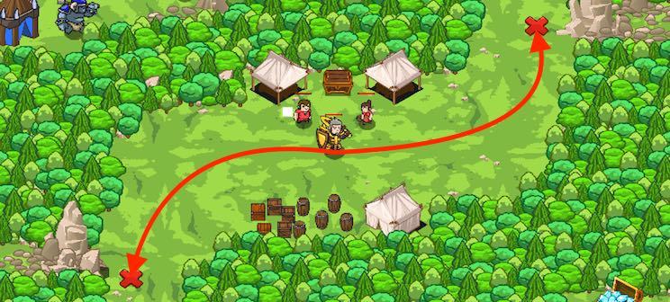

## _Forest Miners_

#### _Legend says:_
> Gem mining is dangerous work!

#### _Goals:_
+ _Humans must survive_
+ _Collect 4 gems_

#### _Topics:_
+ **Strings**
+ **Variables**
+ **While Loops**
+ **If Statements**
+ **If/Else Statements**
+ **Functions**

#### _Items we've got (- or need):_
+ **No longrange glasses**
+ **No Ring of Speed**

#### _Solutions:_
+ **[JavaScript](forestMine.js)**
+ **[Python](forest_mine.py)**

#### _Rewards:_
+ 79 xp
+ 45 gems

#### _Victory words:_
+ _THOSE OGRES WILL BE SPORTING GEM-ENCRUSTED DENTURES SOON!_

___

### _HINTS_

It's your job to make sure no ogres disturb these miners.

First, fill in the `checkEnemyOrSafe()` function. Only call the peasants if there were no ogres, because attacking an ogre will attract attention!

Then, look at the code that checks the top-right X mark, and do something similar to check the bottom-left X mark.

You've learned how to write and call functions with parameters in the previous levels. If you have problems with this level, you can return and repeat levels about functions to refresh your skills.

___
