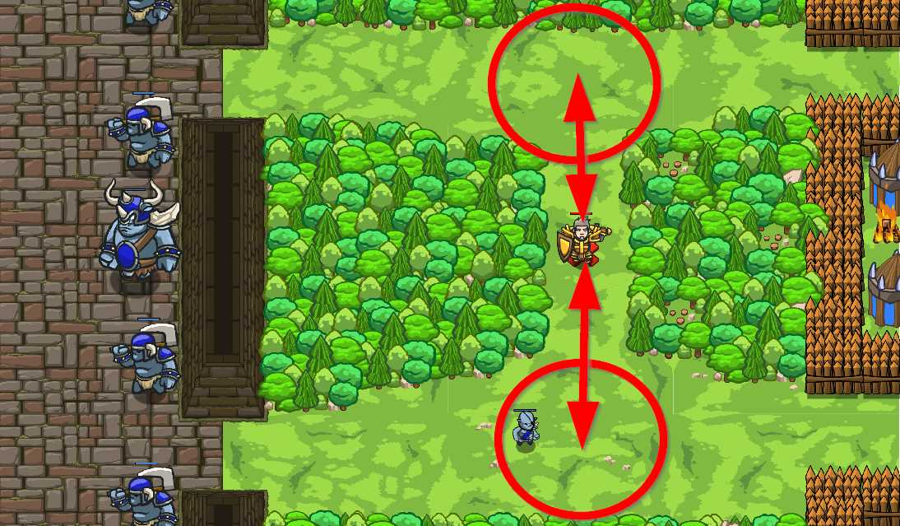

## _Mail Interceptor_

#### _Legend says:_
> Ogres versus skeletons. What can be better?

#### _Goals:_
+ _Defeat all ogre messangers_

#### _Topics:_
+ **Basic Syntax**

#### _Items we've got (- or need):_
+ Weapon
+ **No longrange glasses**

#### _Solutions:_
+ **[JavaScript](mailInter.js)**
+ **[Python](mail_inter.py)**

#### _Rewards:_
+ 79 xp
+ 49 gems

#### _Victory words:_
+ _DO YOU HAVE POSTAGE STAMPS?_

___

### _HINTS_

Ogres are fighting with the undead horde. They send messengers to the ogre camp to get reinforcement.
Your goal is to intercept all messengers from ambush. Don't forget to hide in the trees otherwise, ogres will find you. Ogres don't hear messengers if they are too far from the dungeon.

The main usage of the function here is to make your code clearer. Just put all necessary code to the function body and your `while-true` loop will look elegant and short.

If you have problems with this level, try to return to previous levels and revise them.

___
