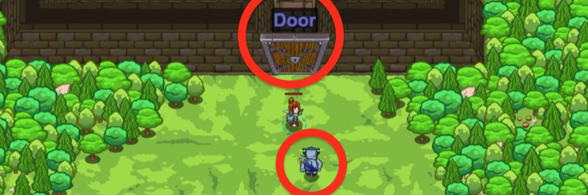

## _Tomb Raider_

#### _Legend says:_
> A forgotten tomb! Time to ransack the place.

#### _Goals:_
+ _Defeat the ogres_
+ _Gain access to the tomb_

#### _Topics:_
+ **Strings**
+ **Variables**
+ **While Loops**
+ **If Statements**
+ **If/Else Statements**
+ **Functions**

#### _Items we've got (- or need):_
+ Weapon

#### _Solutions:_
+ **[JavaScript](tombRaid.js)**
+ **[Python](tomb_raid.py)**

#### _Rewards:_
+ 79 xp
+ 45 gems

#### _Victory words:_
+ _TOMB RAIDING SEEMS LIKE QUITE THE NOBLE PROFESSION._

___

### _HINTS_



Remember that a **parameter** is a way of passing information into a function. It is a predefined variable of whatever the argument is when called!

```javascript
function checkAndEat(target) {
    if(target.type == "fruit") {
        hero.eat(target);
    } else {
        hero.toss(target)
    }
}
while(true) {
    hero.moveUp()
    var nearestTree = hero.findNearestTree()
    var food = hero.harvest(nearestTree)
    checkAndEat(food)
}
```

It's time to fill in the body of a function and use it to make your code nice and clean!

Remember that a **parameter** is just a way of passing information into a standalone function. It is a predefined variable containing whatever was between the `()` when the function was **called**.

**Calling** a function is when the code is actually peformed.  See the examples below as to how functions are called:

```javascript
// This is 'defining' a function
function moveUpAndDown() {
    hero.moveUp();  // This is calling the `moveUp` function
    hero.moveDown();  // This is calling the `moveDown` function
}

hero.say("I'm saying something");  // This is calling the `say` function
moveUpAndDown();  // This is calling the custom defined `moveUpAndDown` function
```

Just use the target like you would any variable!

```javascript
function checkAndDefend(target) {
    if (target) {
        hero.say("I see an enemy! I should beat them up.");
    }
}
```

___
