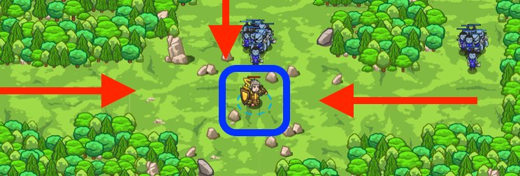

## _Agrippa Refactored_

#### _Legend says:_
> Improve your code by refactoring it into functions.

#### _Goals:_
+ _Rid the meadow of ogres_

#### _Topics:_
+ **Strings**
+ **Variables**
+ **While Loops**
+ **If Statements**
+ **If/Else Statements**
+ **Nested If Statements**

#### _Items we've got (- or need):_
+ Long Sword

#### _Solutions:_
+ **[JavaScript](agrippaRefactored.js)**
+ **[Python](agrippa_refactored.py)**

#### _Rewards:_
+ 74 xp
+ 74 gems

#### _Victory words:_
+ _CLEAN CODE IS A STRATAGEM._

___

### _HINTS_



Did you find **The Agrippa Defense** difficult? Functions can help you clean up your code and make it easier to read.

In this level, you'll replay the same scenario, but this time, you'll solve it much more easily using functions that take arguments! When you want a function to accept arguments, list them in the function's declaration:

```javascript
function valentine(a, b) {
    hero.say(a + " loves " + b);
}

valentine("Angie", "Bobby");
valentine("Bobby", "Carla");
```

Back in **Village Rover**, we used functions to avoid having to repeat the same code over and over. Here, we use functions to clean up our code and make it less complicated.

Your solution to **The Agrippa Defense** probably looked something like this:

```javascript
while (true) {
    var enemy = hero.findNearestEnemy();
    if (enemy) {
        var distance = hero.distanceTo(enemy);
        if (distance < 5) {
            if (hero.isReady("cleave")) {
                hero.cleave(enemy);
            } else {
                hero.attack(enemy);
            }
        }
    }
}
```

That's a lot of nested `if` statements! To make it easier to manage all those `if`s, you can move the innermost block of code into a separate function that can be called in just one line:

```javascript
while (true) {
    var enemy = hero.findNearestEnemy();
    if (enemy) {
        var distance = hero.distanceTo(enemy);
        if (distance < 5) {
            cleaveOrAttack(enemy);
        }
    }
}
```

Notice that when we call `cleaveOrAttack`, we pass the enemy to it as an argument. When you want a function to accept arguments like this, you need to declare them in the function's declaration:

```javascript
function valentine(a, b) { 
    hero.say(a + " loves " + b);
}

valentine("Angie", "Bobby");
valentine("Bobby", "Carla");
```

___
