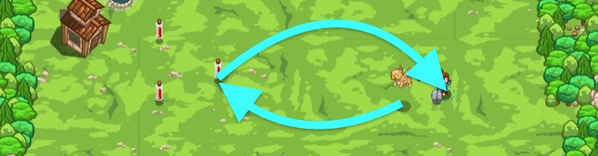

## _Go Fetch_

#### _Legend says:_
> You're caught in a burl trap! Send your pet for help!

#### _Goals:_
+ _Have your pet fetch 3 potions_

#### _Topics:_
+ **Basic Syntax**
+ **Strings**
+ **Variables**
+ **While Loops**
+ **If Statements**
+ **Functions**

#### _Items we've got (- or need):_
+ Pet

#### _Solutions:_
+ **[JavaScript](goFetch.js)**
+ **[Python](go_fetch.py)**

#### _Rewards:_
+ 79 xp
+ 45 gems

#### _Victory words:_
+ _GOT FETCHED!_

___

### _HINTS_



Your pet knows how to fetch items!

```javascript
var item = hero.findNearestItem();
if(item) {
    pet.fetch(item)
}
```

Note that your pet can only fetch certain kinds of items, like potions.

Also important on this level is the `"spawn"` event.

Earlier you used the `"hear"` event to have your pet respond to things she heard.

The `"spawn"` event happens only once, at the start of the level, when your pet is summoned.

You can use a `while` loop inside the event handler function, which allows you to have your pet repeat code, even if the `"spawn"` event only happens once.

___
