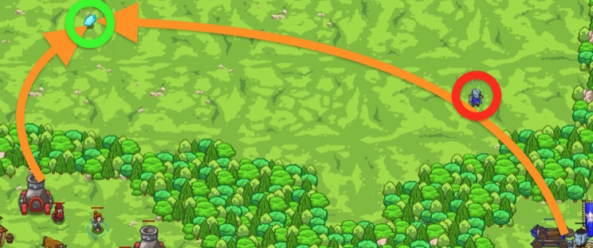

## _Reward and Ruination_

#### _Legend says:_
> Time to prove you, in fact, can have the cake and eat it too.

#### _Goals:_
+ _Collect all the gems_
+ _Defeat all the peons_

#### _Topics:_
+ **Basic Syntax**
+ **Strings**
+ **Variables**
+ **While Loops**
+ **If Statements**
+ **Accessing Properties**

#### _Items we've got (- or need):_
+ Pet

#### _Solutions:_
+ **[JavaScript](reward.js)**
+ **[Python](reward.py)**

#### _Rewards:_
+ 66 xp
+ 71 gems

#### _Victory words:_
+ _DECADENT._

___

### _HINTS_



Concatenate the positions of peons and gems into easy to read strings for the artillery to shoot at.

```javascript
var enemy = hero.findNearestEnemy();
var enemyPos = enemy.pos.x + " " + enemy.pos.y; // This is a string like: "43 20"
hero.say("Enemy at: " + enemyPos); // This says a string like: "Enemy at: 43 20"
```

First find the nearest item and store it in a variable.

```javascript
var item = hero.findNearestItem();
```

Use an `if`-statement to check if an item actually exists inside the variable.

```javascript
if (item) {
    // ...
}
```

Create a variable containing a string of the phrase you want to say:

```javascript
var itemPos = item.pos.x + " " + item.pos.y;
```

Be sure to say the item's position out loud, so the artillery knows where to shoot.

As teased in the previous level, string concatenation can be done on the same line, with multiple strings.

`"Hello" + " " + "World" + "!"` is the same as `"Hello World!"`.

To beat this level you will need to concatenate the positions of peons and gems into easy to read strings for the artillery to shoot at.

```javascript
var enemy = hero.findNearestEnemy();
var enemyPos = enemy.pos.x + " " + enemy.pos.y;  // This is a string like: "43 20"
hero.say("Enemy at: " + enemyPos);  // This says a string like: "Enemy at: 43 20"
```

___
