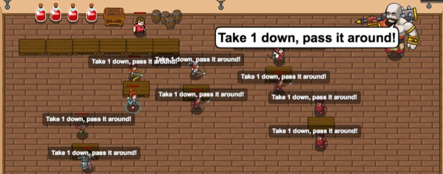

## _Deja Brew_

#### _Legend says:_
> Singing with strings!

#### _Goals:_
+ _Sing along_

#### _Topics:_
+ **Basic Syntax**
+ **Strings**
+ **Arguments**
+ **Arithmetics**
+ **Variables**
+ **While Loops**

#### _Items we've got (- or need):_
+ Pet

#### _Solutions:_
+ **[JavaScript](deja.js)**
+ **[Python](deja.py)**

#### _Rewards:_
+ 79 xp
+ 45 gems

#### _Victory words:_
+ _NOTHING LIKE A PINT OF HEALTH POTION WITH FRIENDS AFTER A LONG DAY FIGHTING OGRES._

___

### _HINTS_



You can **concatenate** (combine) strings with other strings, or numbers:

```javascript
var numberOfPotions = 5;
hero.say("I have " + numberOfPotions + " potions.");
```

Use string concatenation to sing along with your friends!

Listen to what your friends around you are saying and say it back to them!

```javascript
hero.say(potionsOnTheWall + " potions of health!");
```

Remember that concatenation only adds two strings together.

```javascript
hero.say("Take " + numToTakeDown + " down, pass it around!");
```

Finally say the last verse of the song!

You can **concatenate** (combine) strings with other strings, or numbers:

```javascript
var numberOfPotions = 5;
hero.say("I have " + numberOfPotions + " potions.");
```

Use string concatenation to sing along with your friends! The song goes like this:

```
potionsOnTheWall + " potions of health on the wall!"
potionsOnTheWall + " potions of health!"
"Take " + numToTakeDown + " down, pass it around!"
potionsOnTheWall + " potions of health on the wall."
```

___
