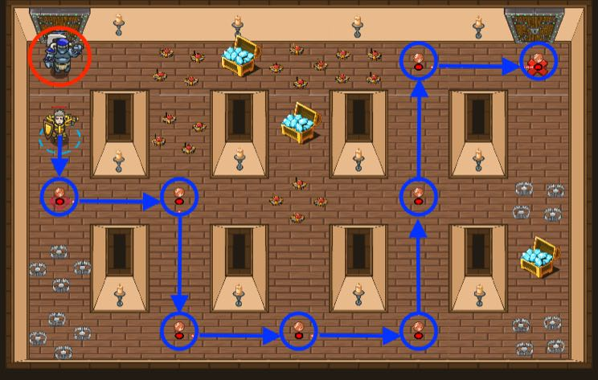

## _Coincrumbs_

#### _Legend says:_
> The storeroom is full of treasures, traps, and a speedy ogre guard.

#### _Goals:_
+ _The ogre mustn't catch the hero_
+ _Escape from the store_

#### _Topics:_
+ **Basic Syntax**
+ **Arguments**
+ **Variables**
+ **While Loops**
+ **If Statements**
+ **Accessing Properties**

#### _Items we've got (- or need):_
+ **Don't use longrange glasses**

#### _Solutions:_
+ **[JavaScript](coincrumbs.js)**
+ **[Python](coincrumbs.py)**

#### _Rewards:_
+ 60 xp
+ 71 gems

#### _Victory words:_
+ _OOH, A PIECE OF CANDY. OOH, A PIECE OF CANDY._

___

### _HINTS_



Can you escape from the storeroom without being caught by the ogre guard? Follow the trail of coins.

Just like checking an enemy's `type`, you can check the position or `pos` of an `item`. You can even find the `x` and `y` coordinates of a `item`'s `pos`.

**Mazes change when you click "Submit"**. Use _item's_ positions instead hard-coding coordinates.

___

Your glasses have the `findNearestItem` method, which lets your hero find the nearest coins (potions, gems etc), but only when they are in your line of sight.

You can move to an coin's position like this:

```javascript
var coin = hero.findNearestItem();
if (coin) {
    var position = coin.pos;
    var coinX = position.x;
    var coinY = position.y;
    hero.moveXY(coinX, coinY);
}
```

Each item is an **object**, which is a type of data, like a **string** of a **number**. Objects contain other pieces of data, known as **properties**.

Each item object (and each unit) has a `pos` property, which stands for its position. And each `pos` is itself an object, which has `x` and `y` properties that you can use with `moveXY` and/or `buildXY`.

___
