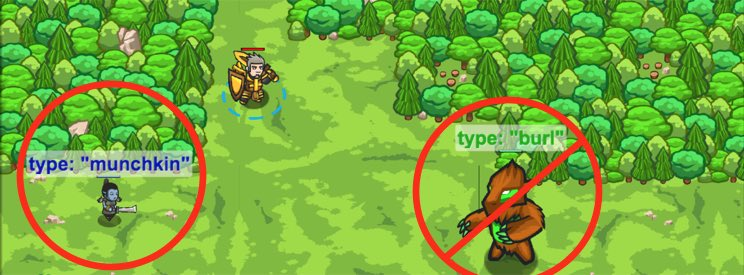

## _Endangered Burl_

#### _Legend says:_
> Hunt ogres in the woods, but watch out for lumbering beasts.

#### _Goals:_
+ _Attack "thrower" and "munchkin" ogres._
+ _Retreat from type "ogre" enemies._

#### _Topics:_
+ **Strings**
+ **Variables**
+ **While Loops**
+ **If Statements**
+ **Accessing Properties**
+ **Boolean Equality**

#### _Items we've got (- or need):_
+ Weapon

#### _Solutions:_
+ **[JavaScript](endangered.js)**
+ **[Python](endangered.py)**

#### _Rewards:_
+ 49 xp
+ 62 gems

#### _Victory words:_
+ _ENVIRONMENTALISTS BEWARE!_

___

### _HINTS_



Learn more about your enemies by checking their `type`.

```javascript
var enemy = hero.findNearestEnemy();
if(enemy.type == "munchkin") {
    hero.attack(enemy);
}
```

Note that `type` is **NOT** a method like `moveXY(20, 20)`. Do not include `()` after `type`.

___

Enemies are `objects`, so they have properties associated with them.

They have their `pos`, or position. They have their `type`, even how much health they have!

Use an `if`-statement to only check for ogres with type `"thrower"`:

```javascript
if (enemy.type == "thrower") {
    // ...
}
```

Be sure to attack the throwers!

```javascript
hero.attack(enemy);
```

Next check if an enemy has the type `"ogre"`! They are big an nasty and should be avoided until you are stronger.

```javascript
if (enemy.type == "ogre") {
    // ...
}
```

If the enemy's `type` is ogre, then run back to the village.

___

Each enemy has a **property** named `type`, which is a **string** (a piece of data in quotes, like "thrower"). 

Using `if`-statements to check the `type` of an enemy allows you to decide to do different things when you see different types of enemies!

In this level, you want to `attack` enemies of type `"thrower"` and `"munchkin"`. You should ignore enemies of `type` `"burl"`, and run away from enemies of `type` `"ogre"`.

You can check the enemy's `type` like this:

```javascript
var enemy = hero.findNearestEnemy();
if (enemy.type == "munchkin") {
    hero.attack(enemy);
}
```

Note that `type` is a **property**, NOT a **method** like `moveXY(20, 20)`. Do not include `()` after `type`.

Be careful to get the syntax of the if-statements correct! Hover over the `if/else` in the lower right to see examples.

___
