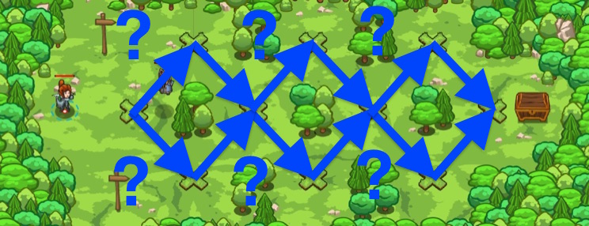

## _Logical Path_

#### _Legend says:_
> Use logic to follow the wizard to his treasure.

#### _Goals:_
+ _Reach the treasure chest_

#### _Topics:_
+ **Basic Syntax**
+ **Variables**
+ **If Statement**
+ **If/Else Statement**
+ **Boolean AND**
+ **Boolean OR**

#### _Items we've got (- or need):_
+ None

#### _Solutions:_
+ **[JavaScript](logicPath.js)**
+ **[Python](logic_path.py)**

#### _Rewards:_
+ 69 xp
+ 79 gems

#### _Victory words:_
+ _NOTHING ILLOGICAL ABOUT THAT._

___

### _HINTS_



Deep in the woods, a wizard presents you with a challenge: if you can figure out his logical riddles, he'll share his treasure with you!

Use _boolean operators_ like **AND**, **OR**, and **NOT** to determine which paths to take at each fork in the road. Check the guide for tips on how to write the code you want.

___

Variables can be used to store `true` or `false` information to make code cleaner and repeatable.

Create a variable to result of the next secret.

The `or` (`||` for JS) operator returns `true` if either or both variables is `true` or `false` if both are false.

```javascript
var secretD = secretA || secretB;
```

Use an `if/else` statement to pick which path the hero should take depending on what the secret is.

```javascript
if (secretD) {
    // ...
} else {
    // ...
}
```

`if` the secret is `true`, move to the correct location:

```javascript
hero.moveXY(32, 33);
```

`else` if the secret is `false`, move to the other location:

```javascript
hero.moveXY(32, 15);
```

After choosing the correct path, move to the next step:

```javascript
hero.moveXY(38, 24);
```

Use the `not` operator to invert the result of the secret. Use this to decide which path to take.

```javascript
// The ! means NOT
var secretE = !secretB
```

In this level, you choose paths based on _boolean values_ (TRUE or FALSE). At each fork in the road, take the high path if the value is TRUE, or the low path if it's FALSE. The wizard gives you the first two values; the rest have to be calculated using _boolean logic._

_Boolean operators_ work on TRUE and FALSE values, and give TRUE or FALSE answers.

The AND operator returns TRUE if _both_ of its inputs are true:

```javascript
// && means AND
var a = true && true;  // a == true
var b = true && false;  // b == false
var c = false && true;  // c == false
var d = false && false;  // d == false
```

The OR operator returns TRUE if _either_ of its inputs are true:

```javascript
// || means OR
var a = true || true;  // a == true
var b = true || false;  // b == true
var c = false || true;  // c == true
var d = false || false;  // d == false
```

The NOT operator works a little differently. It works on one input value, and just gives you the opposite:

```javascript
// ! means NOT
var a = !true;  // a == false
var b = !false;  // b == true
```

As always, you can mix literal TRUE or FALSE values with variables when using boolean logic:

```javascript
var a = !false;  // a == true
var b = a || false;  // b == true
var c = a && b;  // c == true
```

Use all these tools to find your way to the treasure at the end of the path!

___
